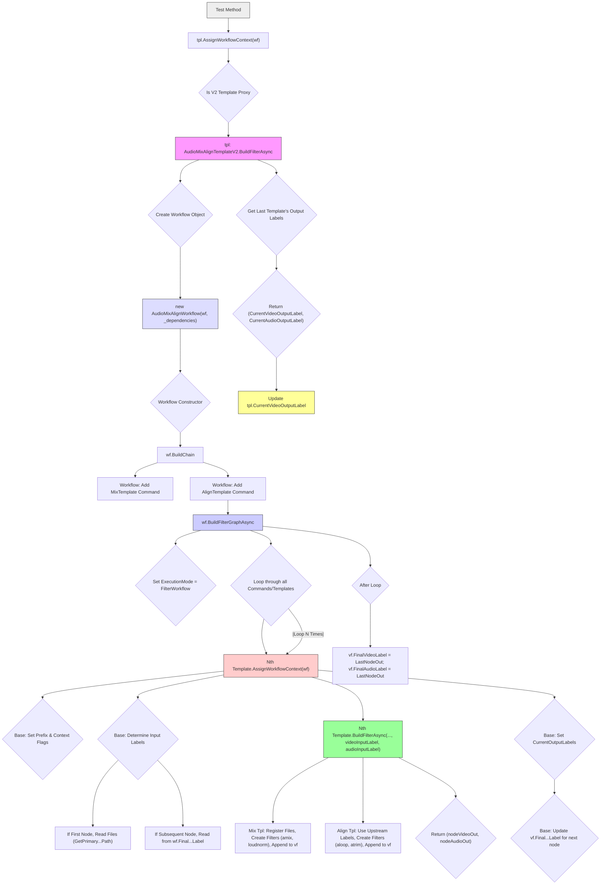

```mermaid
graph TD
    A["Test Method"] --> B["tpl.AssignWorkflowContext(wf)"];
    B --> B1{"Is V2 Template Proxy"};
    B1 --> C["tpl: AudioMixAlignTemplateV2.BuildFilterAsync"];
    C --> C1{"Create Workflow Object"};
    C1 --> D["new AudioMixAlignWorkflow(wf, _dependencies)"];
    D --> D1{"Workflow Constructor"};
    D1 --> D2["wf.BuildChain"];
    D2 --> E["Workflow: Add MixTemplate Command"];
    D2 --> F["Workflow: Add AlignTemplate Command"];
    F --> G["wf.BuildFilterGraphAsync"];

    G --> G1{"Set ExecutionMode = FilterWorkflow"};
    G --> H{"Loop through all Commands/Templates"};
    H --> I["Nth Template.AssignWorkflowContext(wf)"];
    
    I --> J{"Base: Set Prefix & Context Flags"};
    I --> K{"Base: Determine Input Labels"};
    K --> K1["If First Node, Read Files (GetPrimary...Path)"];
    K --> K2["If Subsequent Node, Read from wf.Final...Label"];
    
    I --> L["Nth Template.BuildFilterAsync(..., videoInputLabel, audioInputLabel)"];
    
    L --> M["Mix Tpl: Register Files, Create Filters (amix, loudnorm), Append to vf"];
    L --> N["Align Tpl: Use Upstream Labels, Create Filters (aloop, atrim), Append to vf"];
    L --> O{"Return (nodeVideoOut, nodeAudioOut)"};
    
    I --> P{"Base: Set CurrentOutputLabels"};
    P --> Q{"Base: Update vf.Final...Label for next node"};
    
    H --|Loop N Times|--> I;

    G --> R{"After Loop"};
    R --> S["vf.FinalVideoLabel = LastNodeOut; vf.FinalAudioLabel = LastNodeOut"];

    C --> T{"Get Last Template's Output Labels"};
    T --> U{"Return (CurrentVideoOutputLabel, CurrentAudioOutputLabel)"};
    
    U --> V["Update tpl.CurrentVideoOutputLabel"];

    style C fill:#f9f,stroke:#333
    style G fill:#ccf,stroke:#333
    style L fill:#9f9,stroke:#333
    style I fill:#fcc,stroke:#333
    style D fill:#ddf,stroke:#333
    style A fill:#eee,stroke:#333
    style V fill:#ff9,stroke:#333

```
