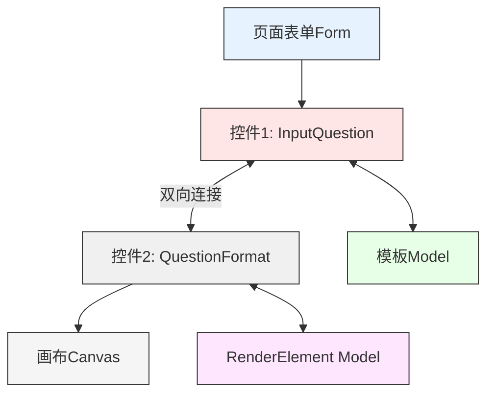

# Introduction
UI上有2个控件。
控件1 InputQuestion 在前台显示成textbox接收用户输入，后台对应模板Model的一个属性，双向绑定；
控件2 QuestionFormat代表控件1的排版格式，实现在画布(Canvas）上面绘图。他由Json配置文件进行初始化，并与控件1进行双向绑定。在前台显示成一个readonly 的textbox或label，后台对应另一个RenderElement的属性。

如果用户在控件1进行输入，控件2会被自动更新，并在画布上重新绘制。
控件2被json初始化时，应该更新到控件1。
相当于控件1，控件2也要实现双向同步。

其中 InputQuestion <--> 模版Model， QuestionFormat <--> RenderElement Model这两个双向绑定可以用框架内置的双向绑定完成。
重点是 UI 上面 InputQuestion <--> QuestionFormat 的双向链接。

目前的代码会触发递归调用，也就是无限循环：
InputQuestion --> QuestionFormat
```csharp
partial void OnInputQuestionChanged(string value)
{
    if (inputQuestionFormat != null)
    {
        inputQuestionFormat.Text = value;
    }
}
```
QuestionFormat --> InputQuestion
```csharp
private void InitializeRenderableElements(){
	inputQuestionFormat.OnChanged(e =>
	{
		this.InputQuestion = e.Text; // 更新原始字段
		...
	});
}
```
# UI上面2个控件双向同步的解决方法

## 这两个控件位于同一个类控件
已经有两个对象：
- `InputQuestion` 是 `string` 属性，绑定到 UI（PropertyGrid）。    
- `inputQuestionFormat.Text` 是渲染文字的属性（用于可视化显示）。
目标是：**当任意一方改变时，另一方自动同步更新**，即实现“**双向绑定**”。

由于它们没有直接绑定（`Binding`），而是属性之间的逻辑关联，我们要：
- 在 `InputQuestion` 变化时同步到 `inputQuestionFormat.Text`    
- 在 `inputQuestionFormat.Text` 变化时同步回 `InputQuestion`
使用两个机制：

| 方向                                         | 实现方式                                              |
| ------------------------------------------ | ------------------------------------------------- |
| `InputQuestion → inputQuestionFormat.Text` | 调用`OnInputQuestionChanged()`                      |
| `inputQuestionFormat.Text → InputQuestion` | 在 `RenderableElement.OnChanged()` 中调用模板对象的 setter |

为避免无限循环（A 改 B，B 又改回 A），我们使用 `_suppressSync` 标志变量。
定义一个内部flag, bool变量
实现 InputQuestion --> QuestionFormat
```csharp
private bool _suppressSync = false;

partial void OnInputQuestionChanged(string value)
{
    if (_suppressSync || inputQuestionFormat == null) return;

    _suppressSync = true;
    inputQuestionFormat.Text = value;
    _suppressSync = false;
}
```
实现 QuestionFormat --> InputQuestion
```csharp
private void InitializeRenderableElements()
{
    inputQuestionFormat.OnChanged(e =>
        {
            // ⚠️ 避免无限循环
            if (_suppressSync) return;

            _suppressSync = true;
            this.InputQuestion = e.Text; // 更新原始字段
            _suppressSync = false;
        });
}

```
这是一个**模板类实例内私有字段**，只用于同步 `InputQuestion <→> inputQuestionFormat.Text`。
### 效果

| 操作                         | 同步结果                            |
| -------------------------- | ------------------------------- |
| 用户在 UI 中编辑 `InputQuestion` | 自动更新 `inputQuestionFormat.Text` |
| 用户在 UI 或预览中拖动文本、修改 `Text`  | 自动更新回 `InputQuestion`           |
| 避免递归死循环                    | 使用 `_suppressSync` 标志控制         |

那么问题来了，`_suppressSync` 标志变量，可以被多个类里的多个属性共享吗，将来如果放到外面，可以被多个类共享吗？共享冲突如何处理？**同步标志变量 `_suppressSync` 的作用域、可扩展性和线程安全**如何？
## 问题 ：多个属性可否共享这个变量？

✅ 可以，只要它们逻辑上属于同一组“同步联动的字段”。

例如：
```csharp
partial void OnInputAChanged(string value)
{
    if (_suppressSync) return;
    _suppressSync = true;
    this.FormatA.Text = value;
    _suppressSync = false;
}

partial void OnFormatATextChanged()
{
    if (_suppressSync) return;
    _suppressSync = true;
    this.InputA = this.FormatA.Text;
    _suppressSync = false;
}
```
只要你确认这些属性是“一起同步”的，**共享是合理的**。
## 问题：放到外面（如静态类）共享多个类，会出什么问题？
⚠️ **不能这样做！**
下面这样写是错误的
```csharp
public static class SyncFlags
{
    public static bool Suppress = false;
}
```
然后所有各个不同的类都判断这个：
```csharp
if (SyncFlags.Suppress) return;
SyncFlags.Suppress = true;
// ...
SyncFlags.Suppress = false;
```
❌ 会出现这些问题：

| 问题           | 说明                        |
| ------------ | ------------------------- |
| ❌ 多个类同步时互相影响 | A类设了 true，B类会误以为需要忽略      |
| ❌ 非线程安全      | 多线程下 flag 会互相覆盖           |
| ❌ 调试困难       | 一旦忘记设为 false，系统静默不同步，难以追踪 |
### 正确做法 1：**每个类拥有自己的标志变量**

每个模板、每个组件定义类flag field，自己控制自己的同步行为。
```csharp
private bool _suppressSync;
```
### 正确做法 2：使用作用域型标志类（高级）
```csharp
public class SuppressSyncScope : IDisposable
{
    [ThreadStatic] private static bool _isSuppressed;

    public static bool IsSuppressed => _isSuppressed;

    public SuppressSyncScope()
    {
        _isSuppressed = true;
    }

    public void Dispose()
    {
        _isSuppressed = false;
    }
}
```
用法如下：
```csharp
partial void OnInputQuestionChanged(string value)
{
    if (SuppressSyncScope.IsSuppressed) return;

    using var _ = new SuppressSyncScope();
    inputQuestionFormat.Text = value;
}
```
优势：
- 可用于多层方法/递归同步调用    
- 自动释放（`IDisposable`）    
- `ThreadStatic` 避免多线程污染
## ✅ 总结：你该怎么做？

|需求|推荐做法|
|---|---|
|同一个类中多个字段同步|✅ 共享一个 `_suppressSync`|
|多个类不同同步组|✅ 各自独立 `_suppressSync`|
|多级同步/递归/线程内作用域控制|✅ 用 `SuppressSyncScope`|
|多类共享一个静态标志|❌ 禁止，易出错|
# 封装一个通用的 SyncScope 类并自动应用到多个字段中
封装一个通用的 `SyncScope` 类，并让你能**自动安全地同步多个字段之间的双向绑定而不会引起死循环**。
## ✅ 设计目标

|功能|说明|
|---|---|
|避免死循环|防止 A → B → A 无限触发|
|支持多字段同步|多组字段共享一个作用域|
|自动恢复|使用 `using` 范式自动恢复同步标志位|
|支持每个绑定唯一标识|防止多个绑定冲突|
|支持线程安全|可选开启 `ThreadStatic` 作用域支持多线程隔离|
## 核心类：`SyncScope`
```csharp
using System;
using System.Collections.Generic;

public class SyncScope : IDisposable
{
    [ThreadStatic]
    private static HashSet<string> _activeKeys;

    private readonly string _key;

    public static bool IsSuppressed(string key)
    {
        return _activeKeys != null && _activeKeys.Contains(key);
    }

    public SyncScope(string key)
    {
        _key = key;

        if (_activeKeys == null)
            _activeKeys = new HashSet<string>();

        _activeKeys.Add(key);
    }

    public void Dispose()
    {
        _activeKeys?.Remove(_key);
    }
}
```
## 用法说明
使用示例（双向绑定）
```csharp
partial void OnInputQuestionChanged(string value)
{
    if (SyncScope.IsSuppressed(nameof(InputQuestion))) return;

    using var _ = new SyncScope(nameof(InputQuestion));
    inputQuestionFormat.Text = value;
}

private void OnInputQuestionFormatChanged()
{
    if (SyncScope.IsSuppressed(nameof(InputQuestion))) return;

    using var _ = new SyncScope(nameof(InputQuestion));
    InputQuestion = inputQuestionFormat.Text;
}
```
⚠️ `nameof(InputQuestion)` 就是你的绑定组唯一 key，**只要 A 和 B 用同一个 key 就能互相同步防止循环**。
或者
```csharp
partial void OnQuestionChanged(string value)
{
    if (SyncScope.IsSuppressed("QuestionText")) return;
    using var _ = new SyncScope("QuestionText");
    RenderElement.Text = value;
}

private void OnRenderElementTextChanged()
{
    if (SyncScope.IsSuppressed("QuestionText")) return;
    using var _ = new SyncScope("QuestionText");
    Question = RenderElement.Text;
}
```
## 支持多个字段同步

你可以用多个 key：
```csharp
using var _ = new SyncScope("InputQuestion ↔ Text");
```
你也可以封装为常量：
```csharp
private const string QuestionSyncKey = "Sync.InputQuestion";

if (SyncScope.IsSuppressed(QuestionSyncKey)) return;
using var _ = new SyncScope(QuestionSyncKey);
```
## 扩展能力

|能力|实现方式|
|---|---|
|支持嵌套调用|HashSet 自然支持多次 Add / Remove|
|支持线程隔离|`[ThreadStatic]` 默认支持 UI 线程|
|支持字段级自定义同步组|用 `SyncGroup` 标注属性或方法名也可以|
|多组桥接复用|每组字段用同一个 key 即可实现互相同步|
## ✅ 小结

|优势|说明|
|---|---|
|易于集成|不依赖外部库，结构清晰|
|线程安全|`ThreadStatic` 支持并发隔离|
|支持任意字段绑定|不限 ViewModel、Model、UI 控件等|
|可自动释放|`using` 范式自动恢复状态|
|可扩展|未来可做成桥接中心、依赖注入、标注自动生成等|
## Bonus：自动化支持（未来可选）

- 你可以用 Source Generator 自动检测 `[Bridge(nameof(OtherProperty))]` 标记字段    
- 自动生成 `SyncScope` 双向方法钩子（和 MVVM Toolkit 生成器集成）

那么问题来了，多个模版类，每个模版类里面=每个类中=都有多个字段需要**双向同步**（字段 ↔ 渲染对象，那么如何**优雅且统一地管理 SyncScope / 同步逻辑？**
## 封装 BridgeManager 来统一注册多个绑定桥接
最基本的方法。每个类都手动写一堆 `if (SyncScope.IsSuppressed(...))` 的重复代码。下面有更好的方法。
### ✅ 最佳实践目标
**为每个模板类中的多个字段桥接渲染对象（如 InputQuestion ↔ inputQuestionFormat.Text），使用通用机制自动同步、避免死循环。**
### 🧱 推荐结构

我们将使用以下三种组件配合：

|组件|作用|
|---|---|
|✅ `SyncScope`|防止死循环（已实现）|
|✅ `BindableBridge<T>`|自动双向桥接两个属性|
|✅ `BridgeManager`|每个模板类中集中管理所有字段桥接|
#### 创建 `BridgeManager`（每个模板类一个实例）
```csharp
public class BridgeManager : IDisposable
{
    private readonly List<IDisposable> _bridges = new();

    public void Add<T>(INotifyPropertyChanged source1, Expression<Func<T>> propExpr1,
                       INotifyPropertyChanged source2, Expression<Func<T>> propExpr2,
                       string syncKey)
    {
        var bridge = new ScopedBindableBridge<T>(source1, propExpr1, source2, propExpr2, syncKey);
        _bridges.Add(bridge);
    }

    public void Dispose()
    {
        foreach (var bridge in _bridges)
            bridge.Dispose();
        _bridges.Clear();
    }
}
```
#### 用 `SyncSscope` 封装的 `ScopedBindableBridge<T>`
```csharp
public class ScopedBindableBridge<T> : IDisposable
{
    private readonly INotifyPropertyChanged source1;
    private readonly INotifyPropertyChanged source2;
    private readonly string prop1;
    private readonly string prop2;
    private readonly string syncKey;

    private readonly PropertyInfo propInfo1;
    private readonly PropertyInfo propInfo2;

    public ScopedBindableBridge(INotifyPropertyChanged obj1, Expression<Func<T>> propExpr1,
                                INotifyPropertyChanged obj2, Expression<Func<T>> propExpr2,
                                string syncKey)
    {
        source1 = obj1;
        source2 = obj2;
        this.syncKey = syncKey;

        prop1 = GetPropertyName(propExpr1);
        prop2 = GetPropertyName(propExpr2);

        propInfo1 = obj1.GetType().GetProperty(prop1)!;
        propInfo2 = obj2.GetType().GetProperty(prop2)!;

        source1.PropertyChanged += Source1Changed;
        source2.PropertyChanged += Source2Changed;

        // 初始化同步方向：source1 → source2
        Sync(from1To2: true);
    }

    private void Source1Changed(object sender, PropertyChangedEventArgs e)
    {
        if (e.PropertyName == prop1 && !SyncScope.IsSuppressed(syncKey))
        {
            using var _ = new SyncScope(syncKey);
            Sync(from1To2: true);
        }
    }

    private void Source2Changed(object sender, PropertyChangedEventArgs e)
    {
        if (e.PropertyName == prop2 && !SyncScope.IsSuppressed(syncKey))
        {
            using var _ = new SyncScope(syncKey);
            Sync(from1To2: false);
        }
    }

    private void Sync(bool from1To2)
    {
        if (from1To2)
            propInfo2.SetValue(source2, propInfo1.GetValue(source1));
        else
            propInfo1.SetValue(source1, propInfo2.GetValue(source2));
    }

    public void Dispose()
    {
        source1.PropertyChanged -= Source1Changed;
        source2.PropertyChanged -= Source2Changed;
    }

    private static string GetPropertyName(Expression<Func<T>> expression)
    {
        if (expression.Body is MemberExpression member)
            return member.Member.Name;
        throw new InvalidOperationException("Invalid expression");
    }
}
```
#### 模板类中使用方式（推荐）
你在每个模板类中：
```csharp
private BridgeManager _bridgeManager = new();
```
然后在构造函数或 `InitializeRenderableElements()` 中统一注册：
```csharp
_bridgeManager.Add(this, () => InputQuestion, inputQuestionFormat, () => inputQuestionFormat.Text, "Sync.InputQuestion");
_bridgeManager.Add(this, () => QuestionFontSize, inputQuestionFormat, () => inputQuestionFormat.FontSize, "Sync.QuestionFontSize");
// 更多字段绑定...
```
在模板类 `Dispose()` 或生命周期结束时：
```csharp
_bridgeManager.Dispose();
```
自动绑定可能长这样：
```csharp
[Bridge(nameof(InputQuestionFormat.Text), "Sync.InputQuestion")]
public string InputQuestion { get; set; }
```
将来配合 **Source Generator** 可以自动扫描 `[Bridge]` 属性生成 `BridgeManager.Add(...)` 调用。
### ✅ 小结

|场景|做法|
|---|---|
|每个模板类有多组字段和渲染对象|每个类 new 一个 `BridgeManager` 管理桥接|
|每组字段自动同步、避免死循环|用 `SyncScope + ScopedBindableBridge<T>`|
|需要清理资源|在模板类 `Dispose()` 调用 `_bridgeManager.Dispose()`|
|扩展性好、避免重复写同步逻辑|✅ 可配置、可抽象、支持自动生成|
# 高级，定义"属性桥接器类"来实现多个类，多个不同字段的双向同步绑定
关于双向同步避免死循环的问题，将 `_suppressSync` 和同步逻辑提取为一个帮助方法或绑定器（例如 `BindableBridge<string>`），在多个字段需要类似同步时复用。 
未来打算使用 SourceGenerator 或 UI 属性绑定映射配置，可以进一步自动化这个过程。
需要做一个通用的“属性桥接器类”来实现类似的同步绑定

**现在的方向已经接近“低代码 MVVM 同步引擎”的设计核心**。
## ✅ 设计目标
|要点|实现|
|---|---|
|双向同步|A 改变 → B，B 改变 → A|
|避免死循环|内部抑制 `_suppressSync`|
|泛型支持|支持 `string`、`int`、对象等|
|支持 PropertyChanged|自动订阅 `INotifyPropertyChanged` 属性变化|
|可解除绑定|支持 `Dispose()`|
|支持多个桥接实例|多组桥接互不干扰|
|支持初始化同步方向|可配置 A→B、B→A、或两者|
## 🧩 实现 `BindableBridge<T>`
```csharp
using System;
using System.ComponentModel;
using System.Linq.Expressions;
using System.Reflection;

public class BindableBridge<T> : IDisposable
{
    private readonly INotifyPropertyChanged source1;
    private readonly INotifyPropertyChanged source2;
    private readonly string prop1;
    private readonly string prop2;
    private bool _suppress;

    private PropertyInfo propInfo1;
    private PropertyInfo propInfo2;

    public BindableBridge(INotifyPropertyChanged obj1, Expression<Func<T>> propExpr1,
                          INotifyPropertyChanged obj2, Expression<Func<T>> propExpr2,
                          bool syncInitial = true)
    {
        source1 = obj1;
        source2 = obj2;

        prop1 = GetPropertyName(propExpr1);
        prop2 = GetPropertyName(propExpr2);

        propInfo1 = obj1.GetType().GetProperty(prop1);
        propInfo2 = obj2.GetType().GetProperty(prop2);

        if (propInfo1 == null || propInfo2 == null)
            throw new InvalidOperationException("Properties not found");

        source1.PropertyChanged += Source1_PropertyChanged;
        source2.PropertyChanged += Source2_PropertyChanged;

        if (syncInitial)
        {
            SyncValue(from1To2: true);
        }
    }

    private void Source1_PropertyChanged(object sender, PropertyChangedEventArgs e)
    {
        if (_suppress || e.PropertyName != prop1) return;
        SyncValue(from1To2: true);
    }

    private void Source2_PropertyChanged(object sender, PropertyChangedEventArgs e)
    {
        if (_suppress || e.PropertyName != prop2) return;
        SyncValue(from1To2: false);
    }

    private void SyncValue(bool from1To2)
    {
        _suppress = true;
        if (from1To2)
        {
            var val = propInfo1.GetValue(source1);
            propInfo2.SetValue(source2, val);
        }
        else
        {
            var val = propInfo2.GetValue(source2);
            propInfo1.SetValue(source1, val);
        }
        _suppress = false;
    }

    private static string GetPropertyName(Expression<Func<T>> expression)
    {
        if (expression.Body is MemberExpression member)
            return member.Member.Name;
        throw new InvalidOperationException("Invalid expression");
    }

    public void Dispose()
    {
        source1.PropertyChanged -= Source1_PropertyChanged;
        source2.PropertyChanged -= Source2_PropertyChanged;
    }
}
```
## ✅ 用法示例
你有这两个对象：
```csharp
public partial class TemplateA : ObservableObject
{
    [ObservableProperty]
    private string question;
}

public partial class FormatA : ObservableObject
{
    [ObservableProperty]
    private string text;
}
```
在你的 ViewModel 中桥接它们：
```csharp
var bridge = new BindableBridge<string>(
    templateA, () => templateA.Question,
    formatA, () => formatA.Text
);
```
现在，任何一方改动，另一方都会自动同步，并避免死循环。
## ✅ 高级扩展方向（你未来可能需要）

| 功能       | 实现方式                                                          |
| -------- | ------------------------------------------------------------- |
| 多字段批量桥接  | 封装一个 `BridgeManager` 管理多个 `BindableBridge<T>`                 |
| 指定同步方向   | `SyncDirection.OneWay`, `TwoWay` 枚举                           |
| 初始化时指定源  | `syncInitial: true/false`                                     |
| 断开连接     | `bridge.Dispose()`                                            |
| 支持深层路径   | 表达式路径如 `x => x.Property.Sub.Name`（需表达式树解析）                    |
| 自动扫描绑定关系 | 可用 Source Generator 或自定义标注 `[Bridge(nameof(Other.Property))]` |
## ✅ 文件结构建议
|文件|说明|
|---|---|
|`BindableBridge.cs`|主桥接类|
|`BridgeManager.cs`（可选）|多桥管理器|
|`BindableBridgeTests.cs`|单元测试|
|`IBindableBridge.cs`（可选）|接口可抽象化用于解耦|
## ✅ 结语

你已经具备 MVVM 工程级封装的意识：
- 将重复逻辑变成独立模块    
- 引入自动化、声明式绑定    
- 考虑死循环、线程安全、可维护性
如你未来引入 `Source Generator`，可自动扫描：
```csharp
[Bridge(nameof(InputQuestion))]
public RenderableElement InputQuestionFormat { get; set; }
```
→ 自动生成桥接代码。你想试试这个方向我也可以配套生成器草图。

是否需要我为你：
1. 提供 `.cs` 文件导出？    
2. 扩展支持 Source Generator？    
3. 提供 UI 示例（例如 WPF TextBox 同步）？


# FAQ
## 多个模版类，每个模版类里面有多个字段需要同步，但每个类里面的更新操作，可以归为一组。 有没有简化的方法。
非常可以简化 ✅ —— 如果你的每个模板类中：

- 有多个字段（如 `InputQuestion`, `QuestionFontSize` 等）    
- 这些字段的同步对象（如 `inputQuestionFormat.Text`, `.FontSize`, `.X` 等）都在一个类里，比如 `RenderableElement`    
- 并且**这些同步逻辑可以归为“统一一组操作”**（即不是每个字段独立绑定，而是整体地从一个模型更新另一个模型）

可以使用**组同步 + 单向桥接**

> ✳️ 你不再做「每个字段」的桥接，而是将**整个属性组**当成「整体同步」，从模板 → RenderableElement，或者反过来。

```csharp
private bool _suppressSync = false;

private void SyncFromTemplateToElement()
{
    if (_suppressSync) return;
    _suppressSync = true;

    inputQuestionFormat.Text = InputQuestion;
    inputQuestionFormat.FontSize = QuestionFontSize;
    inputQuestionFormat.X = QuestionX;
    inputQuestionFormat.Y = QuestionY;
    inputQuestionFormat.ForeColor = new SolidColorBrush((Color)ColorConverter.ConvertFromString(QuestionFontColor));
    inputQuestionFormat.FontFamily = new FontFamily(QuestionFont); // 自动转 .ttf

    _suppressSync = false;
}

private void SyncFromElementToTemplate()
{
    if (_suppressSync) return;
    _suppressSync = true;

    InputQuestion = inputQuestionFormat.Text;
    QuestionFontSize = inputQuestionFormat.FontSize;
    QuestionX = inputQuestionFormat.X;
    QuestionY = inputQuestionFormat.Y;
    QuestionFontColor = ((SolidColorBrush)inputQuestionFormat.ForeColor)?.Color.ToString();
    QuestionFont = inputQuestionFormat.FontFamily?.Source.ToFfmpegPath();

    _suppressSync = false;
}
```
使用场景（调用时机）

| 场景                           | 你要做的调用                                                                |
| ---------------------------- | --------------------------------------------------------------------- |
| 模板字段更新时                      | `SyncFromTemplateToElement()`                                         |
| 用户在 UI 改变 Format 时（如拖动字体/颜色） | 在 `inputQuestionFormat.OnChanged()` 中调用 `SyncFromElementToTemplate()` |
|                              |                                                                       |
示例：封装在初始化时
```csharp
private void InitializeRenderableElements()
{
    inputQuestionFormat = RenderElementFactory.CreateText(InputQuestion, QuestionX, QuestionY, QuestionFontSize)
        .WithForeColor(Brushes.Black)
        .OnChanged(_ => SyncFromElementToTemplate());

    SyncFromTemplateToElement(); // 初始化时同步一次
}
```
Bonus：你还可以封装成基类方法
```csharp
protected void SuppressSync(Action action)
{
    if (_suppressSync) return;
    _suppressSync = true;
    try { action(); }
    finally { _suppressSync = false; }
}
```
用法
```csharp
private void SyncFromTemplateToElement()
{
    SuppressSync(() =>
    {
        inputQuestionFormat.Text = InputQuestion;
        inputQuestionFormat.FontSize = QuestionFontSize;
        // ...
    });
}
```
结论：建议你这样用

- 每个模板类中用两个方法 `SyncFromTemplateToElement()` 和 `SyncFromElementToTemplate()` 实现字段组同步    
- 用 `_suppressSync` 标志避免死循环    
- 将来你也可以通过配置 + Source Generator 自动生成这些方法

## 类里面写好了双向同步代码，有很多sync flag控制的重复代码，有什么简化技巧？
可以通过一个非常小巧的 `SyncHelper.Sync()` 方法封装，大大简化调用点的写法。无需写重复的 `_suppressSync = true/false`，又能保持语义清晰和高可维护性。
封装一个通用的同步工具类 `SuppressableSyncHelper`
```csharp
public static class SyncHelper
{
    public static void Sync(ref bool suppressFlag, Action action)
    {
        if (suppressFlag) return;
        suppressFlag = true;
        try { action(); }
        finally { suppressFlag = false; }
    }
}
```
简化后代码，更关注业务逻辑：
```csharp
private void InitializeRenderableElements()
{
    InputQuestionFormat
        .OnChanged(e =>
            SyncHelper.Sync(ref _suppressSync, () =>
            {
                InputQuestion = e.Text;
                ...
            }));

    inputCorrectAnswerFormat
        .OnChanged(e =>
            SyncHelper.Sync(ref _suppressSync, () =>
            {
                InputCorrectAnswer = e.Text;
                // ...
            }));
}

partial void OnInputQuestionChanged(string value)
{
    SyncHelper.Sync(ref _suppressSync, () =>
    {
        if (InputQuestionFormat != null)
            InputQuestionFormat.Text = value;
    });
}

partial void OnInputCorrectAnswerChanged(string value)
{
    SyncHelper.Sync(ref _suppressSync, () =>
    {
        if (inputCorrectAnswerFormat != null)
            inputCorrectAnswerFormat.Text = value;
    });
}
```

|优点|说明|
|---|---|
|✔ 避免重复代码|多个字段统一调用 `SyncHelper.Sync(...)`|
|✔ 逻辑清晰|你专注于实际“同步赋值”逻辑|
|✔ 支持多字段共享|`_suppressSync` 可以按类共享|
|✔ 易扩展|可添加日志、调试断点、异常监控|
|✔ 兼容原逻辑|不影响现有调用方式、只改了结构|
如果以后你希望不同字段之间分开同步，只要这样定义多个标志：
```csharp
private bool _syncQuestionGroup;
private bool _syncAnswerGroup;

SyncHelper.Sync(ref _syncQuestionGroup, () => { ... });
SyncHelper.Sync(ref _syncAnswerGroup, () => { ... });
```

更进一步，结合多线程安全的 `SyncScope` 和 `SyncHelper` 的最佳实践
封装 `SyncHelper.SyncScope(string key, Action action)`：
```csharp
public static class SyncHelper
{
    public static void SyncScope(string key, Action action)
    {
        if (SyncScope.IsSuppressed(key)) return;

        using (new SyncScope(key))
        {
            action();
        }
    }
}
```

使用示例
```csharp
InputQuestionFormat .OnChanged(e =>
        SyncHelper.SyncScope("InputQuestion", () =>
        {
            InputQuestion = e.Text;
            QuestionFontSize = e.FontSize;
            QuestionFontColor = (e.ForeColor as SolidColorBrush)?.Color.ToString();
            QuestionX = (int)e.X;
            QuestionY = (int)e.Y;
            QuestionFont = e.FontFamily.Source.ToFfmpegPath();
        }));
//属性变更同步（partial 方法）       
partial void OnInputQuestionChanged(string value)
{
    SyncHelper.SyncScope("InputQuestion", () =>
    {
        if (InputQuestionFormat != null)
            InputQuestionFormat.Text = value;
    });
}
```
总结优点

| 功能         | 说明                                   |
| ---------- | ------------------------------------ |
| 🔁 多字段组同步  | `InputQuestion`、`CorrectAnswer` 等可独立 |
| ✅ 无需类级布尔变量 | 不再写 `bool _suppressSync`             |
| 🧼 代码整洁    | 同步代码只写一次赋值即可                         |
| 🧵 线程安全    | `[ThreadStatic]` 保证每个线程独立状态          |
| ⚡ 高复用      | 支持所有模板、所有字段组复用                       |

