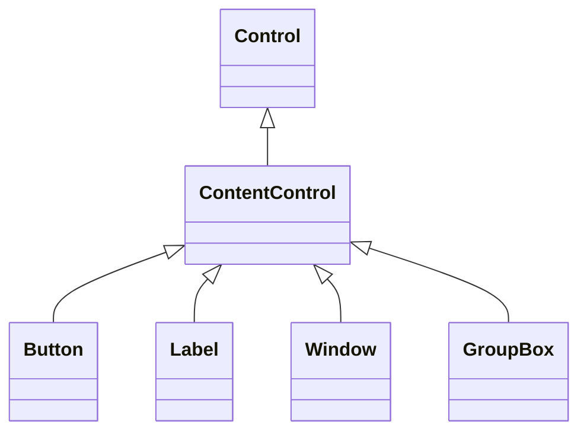
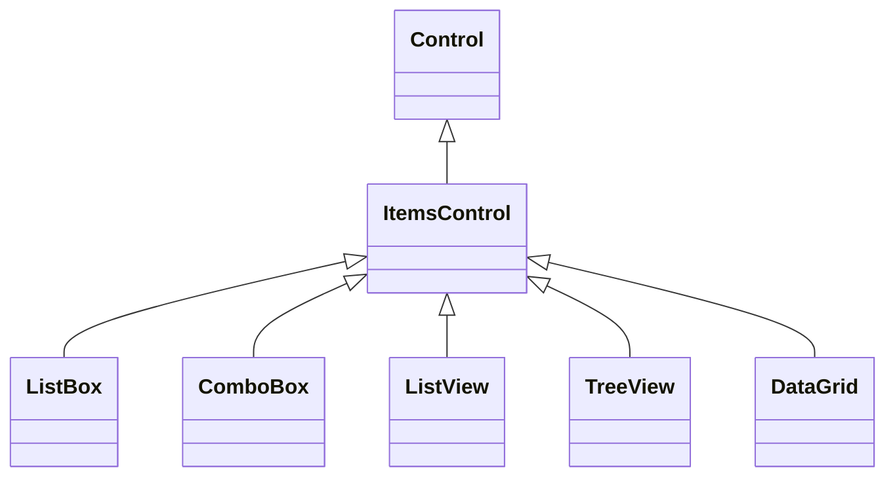

# Introduction

# 常见UI控件
## ContentControl
ContentControl 是 WPF 中一个基础且强大的控件，是 WPF 内容模型的核心组件，它是许多常用控件的基类。
ContentControl 是一个只能包含**单个子元素**的控件，其核心特点是：
- 通过 `Content` 属性承载内容    
- 提供内容呈现模板（`ContentTemplate`）    
- 是大多数"容器型"控件的基类

###  Content 属性
- 可以接受任何类型的对象    
- 直接显示简单类型（字符串、数字等）    
- 通过模板显示复杂对象
```xml
<!-- 字符串内容 -->
<ContentControl Content="简单文本"/>

<!-- 复杂对象 -->
<ContentControl>
    <ContentControl.Content>
        <StackPanel>
            <TextBlock Text="多行"/>
            <TextBlock Text="内容"/>
        </StackPanel>
    </ContentControl.Content>
</ContentControl>
```
- 动态内容切换
```xml
<ContentControl Content="{Binding CurrentView}"/>
```
### 内容模板系统
- `ContentTemplate`：定义如何呈现内容    
- `ContentTemplateSelector`：动态选择模板    
- `ContentStringFormat`：格式化文本显示
```xml
<ContentControl Content="{Binding CurrentDate}">
    <ContentControl.ContentTemplate>
        <DataTemplate>
            <StackPanel>
                <TextBlock Text="{Binding Day}"/>
                <TextBlock Text="{Binding Month}"/>
            </StackPanel>
        </DataTemplate>
    </ContentControl.ContentTemplate>
</ContentControl>
```
配合 DataTemplate 实现动态界面
```xml
<Window.Resources>
    <DataTemplate DataType="{x:Type vm:LoginViewModel}">
        <views:LoginView/>
    </DataTemplate>
    <DataTemplate DataType="{x:Type vm:MainViewModel}">
        <views:MainView/>
    </DataTemplate>
</Window.Resources>
```
### 基于ContentControl的派生控件
几乎所有包含"内容区域"的控件都继承自 ContentControl：

|控件|特殊功能|典型用法|
|---|---|---|
|`Button`|点击事件|`<Button Content="确定"/>`|
|`Label`|助记键支持|`<Label Target="{Binding ElementName=textBox}">_Name</Label>`|
|`Window`|顶级容器|`<Window><Grid>...</Grid></Window>`|
|`GroupBox`|分组边框|`<GroupBox Header="选项"><StackPanel>...</StackPanel></GroupBox>`|
|`TabItem`|选项卡项|`<TabItem Header="页签"><Content>...</Content></TabItem>`|
## ItemsControl
ItemsControl 是 WPF 中用于显示**项目集合**的基础控件，专门用于显示**多个数据项**，它是所有列表型控件的基类。其核心特点是：

- 通过 `Items` 或 `ItemsSource` 属性绑定集合数据    
- 使用 `ItemTemplate` 定义每个项的呈现方式    
- 是 WPF 数据绑定和集合展示的基础设施


### 数据绑定方式
```xml
<!-- 直接添加项 -->
<ItemsControl>
    <sys:String>项目1</sys:String>
    <sys:String>项目2</sys:String>
</ItemsControl>

<!-- 通过ItemsSource绑定 -->
<ItemsControl ItemsSource="{Binding MyItems}"/>
```
### 元素呈现方式
- `ItemTemplate`：定义每个数据项的视觉呈现    
- `ItemContainerStyle`：项容器的样式    
- `ItemsPanel`：控制项目布局的面板
```xml
<ItemsControl ItemsSource="{Binding Employees}">
    <ItemsControl.ItemTemplate>
        <DataTemplate>
            <StackPanel>
                <TextBlock Text="{Binding Name}"/>
                <TextBlock Text="{Binding Department}"/>
            </StackPanel>
        </DataTemplate>
    </ItemsControl.ItemTemplate>
    <ItemsControl.ItemsPanel>
        <ItemsPanelTemplate>
            <WrapPanel/> <!-- 改为流式布局 -->
        </ItemsPanelTemplate>
    </ItemsControl.ItemsPanel>
</ItemsControl>
```
### 派生控件
大多数集合展示控件都继承自 ItemsControl：

|控件|特殊功能|典型用法|
|---|---|---|
|`ListBox`|选择功能|`<ListBox ItemsSource="{Binding Items}"/>`|
|`ComboBox`|下拉选择|`<ComboBox ItemsSource="{Binding Options}"/>`|
|`ListView`|多列视图|`<ListView View="{GridView}">...</ListView>`|
|`TreeView`|层级结构|`<TreeView ItemsSource="{Binding Nodes}"/>`|
|`DataGrid`|表格展示|`<DataGrid ItemsSource="{Binding Data}"/>`|


## 内容控件对比

|特性|ContentControl|ItemsControl|Panel|
|---|---|---|---|
|内容数量|单个|多个|多个|
|内容类型|任意对象|集合项|UI元素|
|典型用途|按钮、标签等|列表、菜单|布局容器|
|数据绑定|直接绑定Content|绑定ItemsSource|一般不直接绑定|


# Resource
## <Application.Resources>
`<Application.Resources>` 是用于定义应用程序级资源（Application-Level Resources）的 XAML 标记。这些资源可以在整个应用程序的所有窗口、页面和控件中共享和访问。以下是详细说明：
- **全局共享**：定义在 `<Application.Resources>` 中的资源（如样式、模板、数据模板、颜色等）对整个应用程序的所有窗口和控件可见。    
- **避免重复定义**：统一管理公共资源（如公司品牌颜色、全局字体样式）。    
- **优先级规则**：如果局部资源（如窗口或控件的资源）与应用程序资源同名，局部资源会覆盖应用程序资源。
### **定义全局样式**
```xml
<Application.Resources>
    <!-- 定义全局按钮样式 -->
    <Style TargetType="Button" x:Key="GlobalButtonStyle">
        <Setter Property="Background" Value="LightBlue"/>
        <Setter Property="FontSize" Value="14"/>
    </Style>
</Application.Resources>
```
**使用方式**：在任意窗口或页面中引用：
```xml
<Button Style="{StaticResource GlobalButtonStyle}" Content="Click"/>
```
### **定义全局数据模板**
```xml
<Application.Resources>
    <!-- 定义如何显示 Person 对象 -->
    <DataTemplate DataType="{x:Type local:Person}">
        <StackPanel Orientation="Horizontal">
            <TextBlock Text="{Binding Name}" FontWeight="Bold"/>
            <TextBlock Text="{Binding Age}" Margin="10,0"/>
        </StackPanel>
    </DataTemplate>
</Application.Resources>
```
**效果**：所有用到 `Person` 类的地方（如 `ListBox`）会自动应用此模板。
### **定义颜色或画笔资源**
```xml
<Application.Resources>
    <!-- 定义全局颜色 -->
    <SolidColorBrush x:Key="PrimaryColor" Color="#FF2A5CAA"/>
</Application.Resources>
```
**使用方式**：
```xml
<Border Background="{StaticResource PrimaryColor}"/>
```
## **资源查找顺序**

WPF 查找资源的优先级：
1. 控件自身的资源    
2. 父容器的资源（如 `Grid.Resources`）    
3. 窗口/页面的资源（如 `Window.Resources`）    
4. 应用程序资源（`Application.Resources`）    
5. 系统主题资源

|资源类型|作用范围|定义位置|
|---|---|---|
|**Application.Resources**|整个应用程序|`App.xaml` 文件中|
|**Window.Resources**|仅当前窗口|窗口的 XAML 文件|
|**Control.Resources**|仅当前控件及其子元素|控件的 XAML 标签内|
# Template

**Template**、**DataTemplate** 和 **ControlTemplate** 是核心的模板机制，用于定义 UI 元素的视觉结构和数据呈现方式。
## **Template 基类**
- **作用**：`Template` 是所有模板的基类概念，代表一个控件的视觉结构。    
- **实际应用**：通常不会直接使用 `Template`，而是使用它的子类（如 `ControlTemplate` 或 `DataTemplate`）。    
**示例**：
```xml
<!-- 这是一个 ControlTemplate 示例，但 Template 本身是抽象概念 -->
<ControlTemplate TargetType="Button">
    <Border Background="LightBlue" CornerRadius="5">
        <ContentPresenter /> <!-- 显示控件的内容 -->
    </Border>
</ControlTemplate>
```
## **ControlTemplate（控件模板）**
- **作用**：定义 **控件的外观和视觉结构**（如 `Button`、`ComboBox` 的样式）。    
- **适用场景**：    
    - 修改控件的默认外观（如自定义 `Button` 的圆角、动画）。        
    - 完全重写控件的视觉树（如把 `CheckBox` 改成开关样式）。        
- **关键特性**：    
    - 使用 `TargetType` 指定目标控件类型（如 `Button`）。        
    - 必须包含 `ContentPresenter` 或 `ItemsPresenter` 以显示内容。
        
- **示例**（自定义 `Button` 样式）：
```xml
<ControlTemplate x:Key="RoundButtonTemplate" TargetType="Button">
    <Grid>
        <Ellipse Fill="LightGreen" Stroke="DarkGreen" StrokeThickness="2"/>
        <ContentPresenter HorizontalAlignment="Center" VerticalAlignment="Center"/>
    </Grid>
</ControlTemplate>

<!-- 使用方式 -->
<Button Template="{StaticResource RoundButtonTemplate}" Content="Click Me"/>
```
## **DataTemplate（数据模板）**
- **作用**：定义 **数据对象如何显示**（如 `ListBox` 中的每一项、`ContentControl` 的内容）。    
- **适用场景**：    
    - 自定义数据对象的 UI 呈现（如 `Person` 类显示为头像 + 姓名）。        
    - 用于 `ItemsControl`（如 `ListBox`、`ComboBox`）的 `ItemTemplate`。        
- **关键特性**：    
    - 使用 `DataType` 指定目标数据类型（如 `local:Person`）。        
    - 不需要 `ContentPresenter`（数据直接绑定到模板内的元素）。        
- **示例**（显示 `Person` 对象）：
```xml
<DataTemplate DataType="{x:Type local:Person}">
    <StackPanel Orientation="Horizontal">
        <Image Source="{Binding Avatar}" Width="50"/>
        <TextBlock Text="{Binding Name}" Margin="10,0"/>
    </StackPanel>
</DataTemplate>

<!-- 自动应用（无需显式指定） -->
<ListBox ItemsSource="{Binding People}"/>
```
## Compasion
- **`ControlTemplate`**：控制 **控件长什么样**（如按钮形状）。    
- **`DataTemplate`**：控制 **数据怎么显示**（如列表项的布局）。    
- **`Template`**：抽象基类，实际编程中通常使用前两者。

|特性|`ControlTemplate`|`DataTemplate`|`Template`（基类）|
|---|---|---|---|
|**作用对象**|控件（如 `Button`）|数据（如 `Person` 对象）|抽象概念|
|**主要用途**|定义控件外观|定义数据可视化方式|无直接使用|
|**关键元素**|`ContentPresenter`|数据绑定（如 `TextBlock`）|-|
|**应用位置**|`Control.Template`|`ItemsControl.ItemTemplate`|-|
|**是否影响逻辑**|否（只改视觉）|否|-|
## 高级用法
### **在 `ControlTemplate` 中使用 `DataTemplate`**
```xml
<!-- 自定义 ComboBox 的外观，并用 DataTemplate 显示每一项 -->
<ControlTemplate x:Key="StyledComboBox" TargetType="ComboBox">
    <Grid>
        <ToggleButton x:Name="DropDownButton" Template="{StaticResource ArrowButtonTemplate}"/>
        <Popup x:Name="Popup">
            <ListBox ItemTemplate="{StaticResource PersonDataTemplate}" 
                     ItemsSource="{Binding Items}"/>
        </Popup>
    </Grid>
</ControlTemplate>
```
### **动态切换模板**
```xml
<!-- 根据条件选择不同 DataTemplate -->
<ContentControl Content="{Binding CurrentItem}">
    <ContentControl.Resources>
        <DataTemplate DataType="{x:Type local:Student}">
            <!-- 学生模板 -->
        </DataTemplate>
        <DataTemplate DataType="{x:Type local:Teacher}">
            <!-- 老师模板 -->
        </DataTemplate>
    </ContentControl.Resources>
</ContentControl>
```

## Style vs Template
在 WPF 中，**`Style`（样式）** 和 **`Template`（模板）** 都是用于定义控件外观的重要机制，但它们的职责和使用场景有本质区别。以下是详细对比：

|特性|**`Style`**|**`Template`**|
|---|---|---|
|**作用对象**|控件的**现有属性**（如颜色、字体）|控件的**整个视觉结构**（如重写按钮外观）|
|**修改范围**|调整已有属性的值|完全替换控件的视觉树|
|**是否影响逻辑**|否（仅改样式）|否（但可绑定到逻辑属性）|
|**常用子类**|`Setter`, `Trigger`|`ControlTemplate`, `DataTemplate`|
|**适用场景**|统一配色、字体等简单定制|彻底改变控件布局或交互视觉效果|
### **`Style`（样式）详解**
#### **功能**
- 通过 `Setter` 修改控件的**已有属性**（如 `Background`、`FontSize`）。    
- 通过 `Trigger` 实现条件样式（如鼠标悬停时变色）。
```xml
<!-- 定义按钮样式 -->
<Style TargetType="Button" x:Key="MyButtonStyle">
    <Setter Property="Background" Value="LightBlue"/>
    <Setter Property="FontWeight" Value="Bold"/>
    <Style.Triggers>
        <Trigger Property="IsMouseOver" Value="True">
            <Setter Property="Foreground" Value="Red"/>
        </Trigger>
    </Style.Triggers>
</Style>

<!-- 应用样式 -->
<Button Style="{StaticResource MyButtonStyle}" Content="Click"/>
```
### **`Template`（模板）详解**
#### **功能**
- 完全替换控件的**视觉树**（Visual Tree），重新定义其外观。    
- 常用子类：    
    - `ControlTemplate`：重写控件外观（如把圆形按钮改成方形）。        
    - `DataTemplate`：定义数据如何显示（如自定义 `ListBox` 的每一项）。
```xml
<!-- 定义按钮模板 -->
<ControlTemplate TargetType="Button" x:Key="CircleButtonTemplate">
    <Grid>
        <Ellipse Fill="{TemplateBinding Background}" Stroke="Black"/>
        <ContentPresenter HorizontalAlignment="Center" VerticalAlignment="Center"/>
    </Grid>
</ControlTemplate>

<!-- 应用模板 -->
<Button Template="{StaticResource CircleButtonTemplate}" 
        Background="Green" Content="OK"/>
```
### 代码对比
####  **修改按钮背景色**
- **用 `Style`**：
```xml
<Style TargetType="Button">
    <Setter Property="Background" Value="Red"/>
</Style>
```
**用 `Template`**：
```xml
<ControlTemplate TargetType="Button">
    <Border Background="Red" CornerRadius="5">
        <ContentPresenter/>
    </Border>
</ControlTemplate>
```
**区别**：`Template` 需要手动重建整个视觉结构（如加 `Border`）。
#### **组合使用**
`Style` 可以包含 `Template`，实现更复杂的定制：
```xml
<Style TargetType="Button" x:Key="ModernButton">
    <Setter Property="Template">
        <Setter.Value>
            <ControlTemplate TargetType="Button">
                <!-- 自定义模板 -->
            </ControlTemplate>
        </Setter.Value>
    </Setter>
    <Setter Property="FontSize" Value="14"/> <!-- 同时设置属性 -->
</Style>
```
#### 总结
- **`Style`** 是“化妆师”——调整控件已有的外观属性。    
- **`Template`** 是“整形医生”——彻底改变控件的视觉结构。    
- **实际开发中**：通常先用 `Style` 统一基础样式，再对特殊控件使用 `Template` 深度定制。

| **需求**       | 推荐方案                | 原因                         |
| ------------ | ------------------- | -------------------------- |
| 统一调整颜色、字体等属性 | `Style`             | 简单高效，无需重建视觉结构              |
| 完全改变控件外观     | `Template`          | 需要重写整个 UI 结构（如把进度条改成圆形）    |
| 动态响应状态（如禁用）  | `Style` + `Trigger` | 直接修改属性比重建模板更轻量             |
| 数据可视化定制      | `DataTemplate`      | 控制数据如何渲染（如 `ListBox` 的每一项） |
- **`TemplateBinding`**：  
    在 `ControlTemplate` 中，用 `{TemplateBinding Property}` 绑定到控件的原始属性（如 `Background`）。    
- **默认模板**：  
    每个控件都有默认的 `ControlTemplate`，可通过工具（如 **ShowMeTheTemplate**）提取参考。    
- **样式继承**：  
    通过 `BasedOn` 继承现有样式：
```xml
 <Style TargetType="Button" BasedOn="{StaticResource BaseStyle}">
    <!-- 扩展样式 -->
</Style>
```   
# Reference