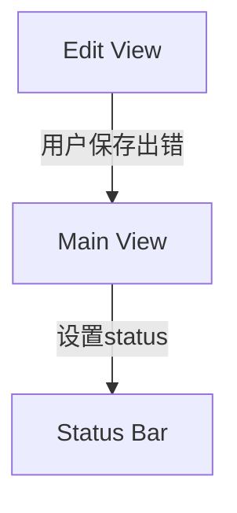
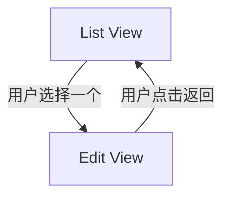

# Callback to ShareService
## 日志 -> 共享服务


主窗口 `MainWindow.xaml` 中status bar绑定到message
```xml
<StatusBar Name="MainStatusBar" DockPanel.Dock="Bottom">
    <TextBlock Text="{Binding StatusMessage}" />
</StatusBar>
```
主窗口 ViewModel 中定义 `StatusMessage` 属性
```c#
private string _statusMessage;
public string StatusMessage
{
    get => _statusMessage;
    set
    {
        _statusMessage = value;
        OnPropertyChanged();
    }
}
```
EditViewModel把错误信息传给主窗口 ViewModel
你有几个选择：
###  方法 1：使用事件回调 callback in viewmodel
在 EditViewModel 中定义：
```csharp
public Action<string>? SetStatusMessage;
...
public void Save(){
	...
	catch (Exception ex)
	{
	    SetStatusMessage?.Invoke($"保存失败：{ex.Message}");
	}
}
```
在创建 EditViewModel 时，注入主窗口方法：
```csharp
var vm = new AddQuestionViewModel(...);
vm.SetStatusMessage = msg => MainViewModel.StatusMessage = msg;
```
### 方法 2：使用共享服务（如 `IStatusService`）
定义一个服务类，或另一个viewmodel
```csharp
public interface IStatusService
{
    string Message { get; set; }
}

public class StatusService : IStatusService, INotifyPropertyChanged
{
    private string _message;
    public string Message
    {
        get => _message;
        set { _message = value; OnPropertyChanged(); }
    }

    public event PropertyChangedEventHandler? PropertyChanged;
    protected void OnPropertyChanged([CallerMemberName] string? name = null)
        => PropertyChanged?.Invoke(this, new PropertyChangedEventArgs(name));
}
```
在 `App.xaml.cs` 里注册：
```csharp
services.AddSingleton<IStatusService, StatusService>();
```
然后在 `MainWindow` 和各 ViewModel 中注入 `IStatusService` 并绑定 `Message` 到 `StatusBar`。
### Bonus：显示几秒后自动清除
你可以这样实现：
```csharp
SetStatusMessage?.Invoke("保存成功！");
Task.Delay(3000).ContinueWith(_ => SetStatusMessage?.Invoke(""));
```
# CodeBehind to MVVM
## 列表->编辑，再返回


### way1: code behind
main window
```csharp
public partial class MainWindow : Window
{
	public MainWindow(IServiceProvider serviceProvider, ResultViewModel result)
	{
	}
	public void LoadView<T>() where T : UserControl
	{
	    this.pnlContent.Children.Clear();
	    var view = this._rootScope.ServiceProvider.GetRequiredService<T>();
	    this.pnlContent.Children.Add(view);
	}
}
```
list view code behind
```csharp
public partial class ListView : UserControl
{
	private MainWindow _mainWindow;
	private readonly EditView _editQuiView;
	public ListQuizView(MainWindow mainWindow, EditView editView)
	{
		InitializeComponent();
		_mainWindow = mainWindow;
		_editView = editView;   
	}
	private async Task Edit(ListViewModel vm)
	{
	    if (vm == null) return;
	    // 跳转到编辑页面
	    await _editViewModel.Load(vm.Id);
	    _editView.DataContext = _editViewModel;
	    _mainWindow.LoadView<EditView>(_editView);
	}
	private void OnBackClicked(object sender, RoutedEventArgs e)
    {
        _mainWindow.LoadView(_editView);
    }
}
```
在edit view添加button
```xml
<Button Content="Back" Margin="5" Click="OnBackClicked" />
```
在edit view code behind添加
```csharp
private void OnBackClicked(object sender, RoutedEventArgs e)
{
	_mainWindow.LoadView(_listView);
}
```
### way2: MVVM
`EditViewModel` 中添加 `BackCommand`
```csharp
public ICommand BackCommand { get; }

public EditQuestionViewModel(
    )
{
    ...
    BackCommand = new RelayCommand(Back); // <--- 新增
}

// 新增的方法：Back
private void Back()
{
	var listView = App.ServiceProvider.GetRequiredService<ListView>();
	_mainWindow.LoadView(_listView);
}
```
`EditView.xaml` 中绑定按钮到命令
```xml
<Button Content="Back" Margin="5" Click="OnBackClicked" />
```
改成
```xml
<Button Content="Back" Margin="5" Command="{Binding BackCommand}"/>
```

# Add Command
## 给view添加一个 download 按钮和调用方法，使用MVVM
为ListCategoryView的 download 按钮添加方法，调用dao的AddOrUpdateCategories()。 要求使用MVVM，优雅的代码。
### 绑定按钮到命令
修改ListCategoryView，添加 `btnDownloadCategory` 按钮的 XAML：
```xml
<Button x:Name="btnDownloadCategory"
        Content="Download Category"
        HorizontalAlignment="Left"
        Margin="176,15,0,0"
        VerticalAlignment="Top"
        Width="142"
        Command="{Binding DownloadCommand}" />
```
### 给view添加独立的 ViewModel 类

```csharp
public class ListCategoryViewModel : INotifyPropertyChanged
{
    private readonly ICategoryDao _categoryDao;
    
    public ICommand DownloadCommand { get; }

    public ListCategoryViewModel(ICategoryDao categoryDao)
    {
        _categoryDao = categoryDao;
        DownloadCommand = new AsyncRelayCommand(DownloadCategoriesAsync);
    }

    public event PropertyChangedEventHandler? PropertyChanged;

    private void OnPropertyChanged(string propertyName) =>
        PropertyChanged?.Invoke(this, new PropertyChangedEventArgs(propertyName));

    private async Task DownloadCategoriesAsync()
    {
        var externalCategories = await LoadFromExternalSourceAsync();

        await _categoryDao.AddOrUpdateCategories(SourceEnum.SourceA, externalCategories);
        _resultService.SetSuccess("Categories downloaded and updated.");
    }

    // 假设从网络/API 或本地文件加载外部数据
    private async Task<ICollection<Category>> LoadFromExternalSourceAsync()
    {
        await Task.Delay(500); // 模拟延迟
        return new List<Category>
        {
            new Category { Name = "History", ShortName = "history" },
            new Category { Name = "Science", ShortName = "science" }
        };
    }
}
```

### 在 `ListCategoryView.xaml.cs` 中注入 ViewModel
将它作为一个字段并传入 `DataContext`：
```csharp
public partial class ListCategoryView : UserControl
{
    private readonly ListCategoryPageViewModel _viewModel;

    public ListCategoryView(MainWindow mainWindow,
                            ListCategoryPageViewModel viewModel)
    {
        InitializeComponent();
        _viewModel = viewModel;
        this.DataContext = _viewModel;
    }
}
```
### DI 注册依赖

在 `Program.cs` 或 `App.xaml.cs` 中配置：
```csharp
services.AddTransient<ListCategoryViewModel>();

```
# 我定义泛型viewmodel，怎么实现泛型view？
为了使view模块更通用，我定义了泛型view model，怎么实现泛型view来支持泛型view model？
**WPF 的 XAML 编译器不支持泛型 UserControl 的代码生成**。如果强行将view从code behind定义成泛型，编译会出错：
```csharp
public partial class SelectListView<T> : UserControl where T : ISelectSupport, IImageAware, INameAware
{
    public SelectListView()
    {
        InitializeComponent();
        this.DataContext = new SelectListViewModel<T>();
        SetupUi();
    }
    public void SetupUi(){
	    this.grdList.Init();
	    this.dataPager.Init();
	    ...
    }
}
```

导致 `.xaml` 中定义的控件（如 `grdList`, `dataPager`）和方法（如 `InitializeComponent`）不会被自动生成进 `*.g.cs` 文件中。

原因：WPF 的 XAML 编译器 **不支持泛型类和 XAML 联动**
- 泛型类不会自动生成 `InitializeComponent()`    
- `x:Name="..."` 标记的控件不会生成字段    
- XAML 文件绑定不到泛型类（如 `SelectListView<T>`）

WPF 的 XAML 与 InitializeComponent() 是通过编译时的 code-behind 文件绑定的，而这套机制 不支持泛型类，这个类不会被正确地绑定到对应的 SelectListView.xaml，从而：
> InitializeComponent() 不存在
> grdList, dataPager 等 XAML 元素无法访问
## 方法1 非泛型 XAML + 泛型逻辑分离（推荐）
与xaml绑定的code behind不能使用泛型。正常写：
```csharp
public partial class SelectListView : UserControl
{
    public SelectListView()
    {
        InitializeComponent();
    }
    public SfDataGrid Grid => grdList;
    public SfDataPager Pager => dataPager;
}
```
但这个view只呈现页面上的基本元素，不包括任何UI行为。
```xml
<UserControl x:Class="YourApp.Views.SelectListView"
             xmlns="http://schemas.microsoft.com/winfx/2006/xaml/presentation"
             xmlns:x="http://schemas.microsoft.com/winfx/2006/xaml"
             xmlns:syncfusion="http://schemas.syncfusion.com/wpf"
             x:Name="Root">
    <Grid>
        <Grid.RowDefinitions>
            <RowDefinition Height="*" />
            <RowDefinition Height="Auto" />
        </Grid.RowDefinitions>

        <syncfusion:SfDataGrid x:Name="grdList" AutoGenerateColumns="True" />

        <syncfusion:SfDataPager x:Name="dataPager" Grid.Row="1" PageSize="10" />
    </Grid>
</UserControl>

``` 

写一个泛型逻辑类包装所有 UI 行为，向这个类注入view对象，处理行为：
```csharp
public class SelectListViewLogic<T> where T : ISelectSupport, ...
{
    private readonly SelectListView _view;
    private ObservableCollection<T> _items = new();

    public SelectListViewLogic(SelectListView view)
    {
        _view = view;        
        SetupUi();
    }
    private void SetupUi()
    {
        _view.Grid.SelectionMode = GridSelectionMode.Multiple;
        _view.Grid.Setup(); 
        _view.Pager.PageSize = _displaySettings.PageSize;
        _view.Pager.Source = _items;
        _view.Grid.ItemsSource = _view.Pager.PagedSource;
        ...
    }
    public void SetData(IEnumerable<T> source)
    {
        if (_view.DataContext is not SelectListViewModel<T> vm)
            throw new InvalidOperationException("ViewModel 类型不匹配");

        vm.Items.Clear();
        vm.SelectedItems.Clear();
        _items.Clear();

        foreach (var item in source)
        {
            vm.Items.Add(item);
            _items.Add(item);
        }
    }
```

外部使用方法：
```csharp
// 创建视图（非泛型，可以放在 XAML 或代码中）
var view = new SelectListView();
// 创建 ViewModel（泛型）
var viewModel = new SelectListViewModel<MyType>();
view.DataContext = viewModel;
// 将view放入父页面留好的容器
ParentContainerHost.Children.Clear()
ParentContainerHost.Children.Add(view);

// 创建逻辑处理类，传入 view（控制 UI 行为）
var logic = new SelectListViewLogic<MyType>(view);
// 设置数据源（自动分页、同步 ViewModel）
logic.SetData(GetMyItemsFromDb());
```
> view类 正常通过DataConext接收数据。但由logic类负责处理

```
╭────────────────────────╮
│    MainWindow / Host   │
│                        │
│   ┌────────────────┐   │
│   │ SelectListView │◄───────────── Logic 用来控制它
│   └────────────────┘   │
│         ▲              │
│         │              │
│         ▼              │
│   SelectListViewLogic<T>   ─── 控制分页、选中逻辑等
│         ▲
│         │
│         ▼
│   SelectListViewModel<T>   ─── 绑定 Items, Commands
╰────────────────────────╯

```

## **方案二：纯代码构建 UI（不使用 XAML）**

如果你确实想保留 `SelectListView<T>` 形式，那就必须：
- 不使用 `XAML` 文件，可以删除.xaml; .xaml.cs 可以保留直接改写。或者完善删除重新创建.cs进行改写    
- 所有控件和布局用 C# 代码创建；    
- 自己创建 `grdList` 和 `dataPager` 等控件并加入到控件树中。
代码：
```csharp
public class SelectListView<T> : UserControl where T : ISelectSupport, INameAware, ICreatedTimeAware, IImageAware
    {
        private readonly Grid _layoutGrid;
        private readonly SfDataGrid _grdList;
        private readonly SfDataPager _dataPager;

        private readonly ObservableCollection<object> _internalItems = new();

        public SelectListView()
        {
            // 初始化控件
            _layoutGrid = new Grid();
            _grdList = new SfDataGrid();
            _dataPager = new SfDataPager();

            InitLayout();   // 布局
            InitGrid();     // 设置 SfDataGrid
            InitPager();    // 设置分页器

            Content = _layoutGrid;
        }

        private void InitLayout()
        {
            _layoutGrid.RowDefinitions.Add(new RowDefinition { Height = new GridLength(1, GridUnitType.Star) });
            _layoutGrid.RowDefinitions.Add(new RowDefinition { Height = GridLength.Auto });

            Grid.SetRow(_grdList, 0);
            Grid.SetRow(_dataPager, 1);

            _layoutGrid.Children.Add(_grdList);
            _layoutGrid.Children.Add(_dataPager);
        }

        private void InitGrid()
        {
            _grdList.SelectionMode = GridSelectionMode.Multiple;
            _grdList.AutoGenerateColumns = true;
            _grdList.ItemsSource = _dataPager.PagedSource;
            ...
        }
```

使用方法：在你主窗口或页面中：
```csharp
var viewModel = new SelectListViewModel<MyItem>();
var view = new SelectListView<MyItem>();
view.DataContext = viewModel;

var data = LoadMyItems(); // 从数据库或 mock 数据
view.SetData(data);

// 放到页面上（例如某个 Grid 容器中）
MyContentGrid.Children.Add(view);
```

# References 
