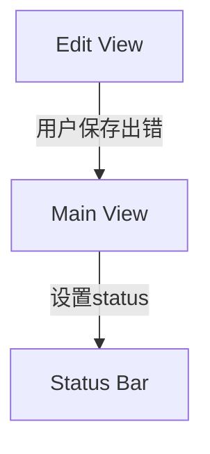
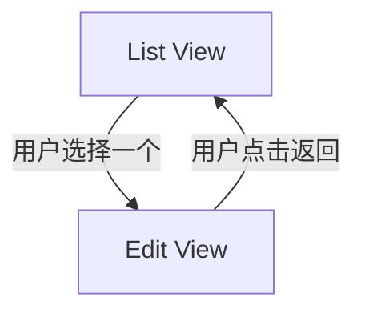

# Callback to ShareService
## 日志 -> 共享服务


主窗口 `MainWindow.xaml` 中status bar绑定到message
```xml
<StatusBar Name="MainStatusBar" DockPanel.Dock="Bottom">
    <TextBlock Text="{Binding StatusMessage}" />
</StatusBar>
```
主窗口 ViewModel 中定义 `StatusMessage` 属性
```c#
private string _statusMessage;
public string StatusMessage
{
    get => _statusMessage;
    set
    {
        _statusMessage = value;
        OnPropertyChanged();
    }
}
```
EditViewModel把错误信息传给主窗口 ViewModel
你有几个选择：
###  方法 1：使用事件回调 callback in viewmodel
在 EditViewModel 中定义：
```csharp
public Action<string>? SetStatusMessage;
...
public void Save(){
	...
	catch (Exception ex)
	{
	    SetStatusMessage?.Invoke($"保存失败：{ex.Message}");
	}
}
```
在创建 EditViewModel 时，注入主窗口方法：
```csharp
var vm = new AddQuestionViewModel(...);
vm.SetStatusMessage = msg => MainViewModel.StatusMessage = msg;
```
### 方法 2：使用共享服务（如 `IStatusService`）
定义一个服务类，或另一个viewmodel
```csharp
public interface IStatusService
{
    string Message { get; set; }
}

public class StatusService : IStatusService, INotifyPropertyChanged
{
    private string _message;
    public string Message
    {
        get => _message;
        set { _message = value; OnPropertyChanged(); }
    }

    public event PropertyChangedEventHandler? PropertyChanged;
    protected void OnPropertyChanged([CallerMemberName] string? name = null)
        => PropertyChanged?.Invoke(this, new PropertyChangedEventArgs(name));
}
```
在 `App.xaml.cs` 里注册：
```csharp
services.AddSingleton<IStatusService, StatusService>();
```
然后在 `MainWindow` 和各 ViewModel 中注入 `IStatusService` 并绑定 `Message` 到 `StatusBar`。
### Bonus：显示几秒后自动清除
你可以这样实现：
```csharp
SetStatusMessage?.Invoke("保存成功！");
Task.Delay(3000).ContinueWith(_ => SetStatusMessage?.Invoke(""));
```
# CodeBehind to MVVM
## 列表->编辑，再返回


### way1: code behind
main window
```csharp
public partial class MainWindow : Window
{
	public MainWindow(IServiceProvider serviceProvider, ResultViewModel result)
	{
	}
	public void LoadView<T>() where T : UserControl
	{
	    this.pnlContent.Children.Clear();
	    var view = this._rootScope.ServiceProvider.GetRequiredService<T>();
	    this.pnlContent.Children.Add(view);
	}
}
```
list view code behind
```csharp
public partial class ListView : UserControl
{
	private MainWindow _mainWindow;
	private readonly EditView _editQuiView;
	public ListQuizView(MainWindow mainWindow, EditView editView)
	{
		InitializeComponent();
		_mainWindow = mainWindow;
		_editView = editView;   
	}
	private async Task Edit(ListViewModel vm)
	{
	    if (vm == null) return;
	    // 跳转到编辑页面
	    await _editViewModel.Load(vm.Id);
	    _editView.DataContext = _editViewModel;
	    _mainWindow.LoadView<EditView>(_editView);
	}
	private void OnBackClicked(object sender, RoutedEventArgs e)
    {
        _mainWindow.LoadView(_editView);
    }
}
```
在edit view添加button
```xml
<Button Content="Back" Margin="5" Click="OnBackClicked" />
```
在edit view code behind添加
```csharp
private void OnBackClicked(object sender, RoutedEventArgs e)
{
	_mainWindow.LoadView(_listView);
}
```
### way2: MVVM
`EditViewModel` 中添加 `BackCommand`
```csharp
public ICommand BackCommand { get; }

public EditQuestionViewModel(
    )
{
    ...
    BackCommand = new RelayCommand(Back); // <--- 新增
}

// 新增的方法：Back
private void Back()
{
	var listView = App.ServiceProvider.GetRequiredService<ListView>();
	_mainWindow.LoadView(_listView);
}
```
`EditView.xaml` 中绑定按钮到命令
```xml
<Button Content="Back" Margin="5" Click="OnBackClicked" />
```
改成
```xml
<Button Content="Back" Margin="5" Command="{Binding BackCommand}"/>
```

# Add Command
## 给view添加一个 download 按钮和调用方法，使用MVVM
为ListCategoryView的 download 按钮添加方法，调用dao的AddOrUpdateCategories()。 要求使用MVVM，优雅的代码。
### 绑定按钮到命令
修改ListCategoryView，添加 `btnDownloadCategory` 按钮的 XAML：
```xml
<Button x:Name="btnDownloadCategory"
        Content="Download Category"
        HorizontalAlignment="Left"
        Margin="176,15,0,0"
        VerticalAlignment="Top"
        Width="142"
        Command="{Binding DownloadCommand}" />
```
### 给view添加独立的 ViewModel 类

```csharp
public class ListCategoryViewModel : INotifyPropertyChanged
{
    private readonly ICategoryDao _categoryDao;

    public ListCategoryViewModel(ICategoryDao categoryDao)
    {
        _categoryDao = categoryDao;
        DownloadCommand = new AsyncRelayCommand(DownloadCategoriesAsync);
    }

    public ICommand DownloadCommand { get; }

    public event PropertyChangedEventHandler? PropertyChanged;

    private void OnPropertyChanged(string propertyName) =>
        PropertyChanged?.Invoke(this, new PropertyChangedEventArgs(propertyName));

    private async Task DownloadCategoriesAsync()
    {
        var externalCategories = await LoadFromExternalSourceAsync();

        await _categoryDao.AddOrUpdateCategories(SourceEnum.SourceA, externalCategories);
        _resultService.SetSuccess("Categories downloaded and updated.");
    }

    // 假设从网络/API 或本地文件加载外部数据
    private async Task<ICollection<Category>> LoadFromExternalSourceAsync()
    {
        await Task.Delay(500); // 模拟延迟
        return new List<Category>
        {
            new Category { Name = "History", ShortName = "history" },
            new Category { Name = "Science", ShortName = "science" }
        };
    }
}
```

### 在 `ListCategoryView.xaml.cs` 中注入 ViewModel
将它作为一个字段并传入 `DataContext`：
```csharp
public partial class ListCategoryView : UserControl
{
    private readonly ListCategoryPageViewModel _viewModel;

    public ListCategoryView(MainWindow mainWindow,
                            ListCategoryPageViewModel viewModel)
    {
        InitializeComponent();
        _viewModel = viewModel;
        this.DataContext = _viewModel;
    }
}
```
### DI 注册依赖

# 配置
在 `Program.cs` 或 `App.xaml.cs` 中：
```csharp
services.AddTransient<ListCategoryViewModel>();

```
# FAQ


# References 
