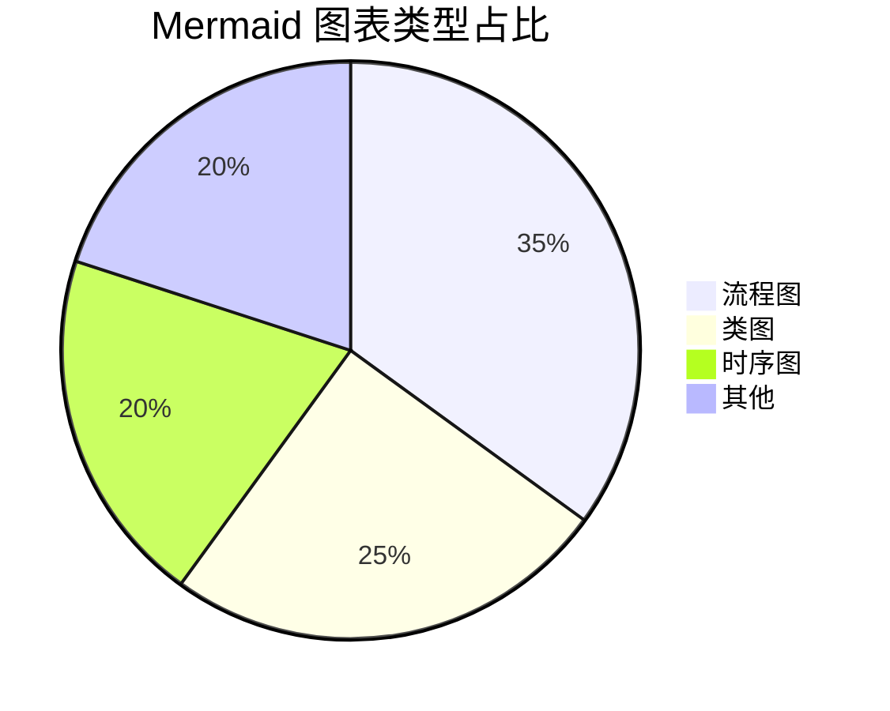
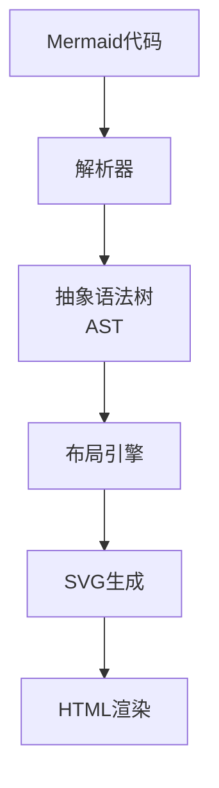
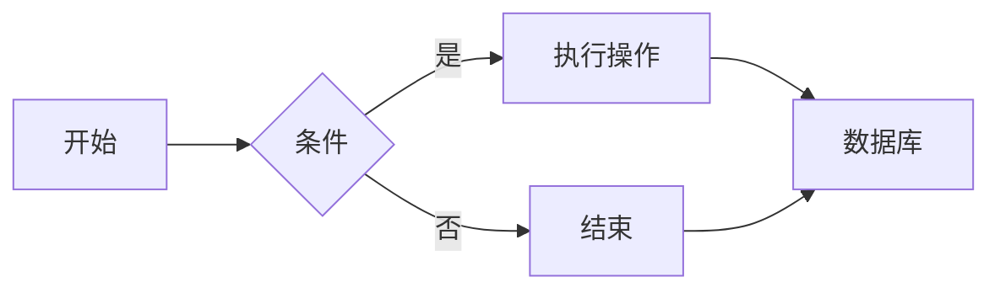
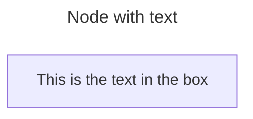
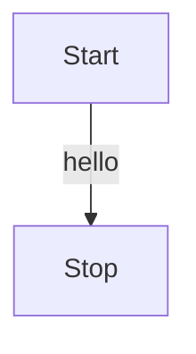
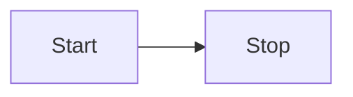
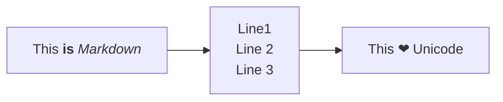

# Introduction
Mermaid 是一个基于 JavaScript 的开源图表生成工具，它允许您使用简单的文本语法创建各种图表，并自动渲染成可视化图形。主要特点包括：

- **文本定义图表**：用类似 Markdown 的语法编写图表    
- **自动布局**：无需手动调整元素位置    
- **多图表支持**：支持类图、流程图、时序图、甘特图等    
- **跨平台**：可在各种支持 JavaScript 的环境中使用


## How to generate diagram
这种语法之所以能生成图表，是因为：
1. **文本解析**：Mermaid 解析器（基于 [ANTLR](https://www.antlr.org/) 或自定义解析器）将文本转换为抽象语法树（AST）    
2. **布局计算**：自动计算节点位置和连线路径(**Dagre** 等图形布局库)    
3. **SVG渲染**：最终输出为**可缩放**矢量图形

## 核心图表类型

| 图表类型    | 语法示例                          | 用途     |       |
| ------- | ----------------------------- | ------ | ----- |
| **流程图** | `graph TD; A-->B`             | 展示流程步骤 |       |
| **类图**  | `classDiagram; A <            | -- B`  | 展示类关系 |
| **时序图** | `sequenceDiagram; A->>B: 消息`  | 展示交互时序 |       |
| **甘特图** | `gantt; section 任务`           | 项目管理   |       |
| **饼图**  | `pie; "A": 30`                | 比例分布   |       |
| **状态图** | `stateDiagram; [*] --> State` | 状态转换   |       |
# How to use
## Flowchart

### 例子
```
---
title: Node with text
---
flowchart LR
    id1[This is the text in the box]
```

### Direction
define direction of the Flowchart. 
- TB - Top to bottom
- TD - Top-down/ same as top to bottom
- BT - Bottom to top
- RL - Right to left
- LR - Left to right
```
flowchart TD
    Start --hello --> Stop
```

```
flowchart LR
    Start --> Stop
```

### Text
Use double quotes and backticks "` text `" to enclose the markdown text.
Use `"` to enclose the unicode text.
```
---
config:
  flowchart:
    htmlLabels: false
---
flowchart LR
    markdown["`This **is** _Markdown_`"]
    newLines["`Line1
    Line 2
    Line 3`"]
    id["This ❤ Unicode"]
    markdown --> newLines
    newLines --> id
```

## Sequence Diagram
## Class Diagram
```mermaid
classDiagram
    Animal <|-- Duck
    Animal <|-- Cat
    Animal : +int age
    Animal : +String name
    Animal : +eat()```
Sequence diagram
```mermaid
sequenceDiagram
    Alice->>John: 你好！
    John-->>Alice: 你好吗？
    Alice->>John: 很好！
```
## State Diagram

## ERD Diagram
## Gantt
## Pie Chart
## Mindmaps

## 网页中集成
```javascript
// 在网页中集成
import mermaid from 'mermaid';

mermaid.initialize({
  startOnLoad: true,
  theme: 'default',
  flowchart: { useMaxWidth: false }
});

// 手动渲染特定元素
mermaid.init(undefined, '.mermaid');
```
# Editors
**Mermaid 编辑器列表（Web/桌面端对比）**

| 工具名称                    | 运行平台   | 特点                 | 支持功能      | 是否免费  | 链接                                                                                 |
| ----------------------- | ------ | ------------------ | --------- | ----- | ---------------------------------------------------------------------------------- |
| **Mermaid Live Editor** | Web    | 官方在线版，实时渲染         | 基础图表      | 是     | [访问](https://mermaid.live/)                                                        |
| **Mermaid Chart**       | Web    | 增强版在线编辑器，AI生成      | 协作、版本控制   | 免费+付费 | [访问](https://www.mermaidchart.com/)                                                |
| **VS Code + Mermaid插件** | 桌面     | 代码编辑器集成，Markdown预览 | 全功能支持     | 是     | [插件](https://marketplace.visualstudio.com/items?itemName=bierner.markdown-mermaid) |
| **Obsidian**            | 桌面     | 本地笔记软件内置支持         | 实时预览+导出   | 是     | [官网](https://obsidian.md/)                                                         |
| **Typora**              | 桌面     | 简洁Markdown编辑器      | 导出为图片/PDF | 付费    | [官网](https://typora.io/)                                                           |
| **GitLab/GitHub**       | Web    | 原生支持渲染Mermaid代码块   | 仅查看（无编辑）  | 是     | -                                                                                  |
| **Mermaid CLI**         | 桌面     | 命令行工具，批量生成图表       | 自动化渲染     | 是     | [文档](https://github.com/mermaid-js/mermaid-cli)                                    |
| **JupyterLab**          | 桌面/Web | 数据科学笔记本集成          | 交互式图表     | 是     | [插件](https://github.com/mermaid-js/jupyterlab-mermaid)                             |
# **文本驱动图表工具**
|工具名称|类型|核心优势|局限性|适用场景|是否开源|
|---|---|---|---|---|---|
|**PlantUML**|文本生成|专业的UML支持，语法严谨|学习曲线陡峭，需Java环境|软件架构设计|✅|
|**Graphviz**|DOT语言|复杂网络关系可视化，自动布局强大|需编写DOT文件，交互性弱|系统拓扑图/依赖关系|✅|
|**D2**|新兴语言|语法更直观，自动布局优秀|生态尚未成熟|技术文档/系统架构|✅|
|**Nomnoml**|文本|极简类图，在线即用|功能单一|快速草图设计|✅|

# 在线Web图表工具

### **免费 Web 绘图工具对比表**

|工具名称|特点|优点|缺点|适用场景|
|---|---|---|---|---|
|**Excalidraw**|- 手绘风格白板  <br>- 开源+端到端加密  <br>- 协作实时编辑|✅ 极简设计，适合草图  <br>✅ 完全免费，无账号要求  <br>✅ 支持导出为PNG/SVG|❌ 无高级图形库  <br>❌ 缺少流程图自动化布局|技术讨论、头脑风暴、快速原型设计|
|**draw.io**|- 专业级图表工具  <br>- 支持Mermaid导入  <br>- 多模板（AWS/架构图等）|✅ 功能全面，支持复杂图表  <br>✅ 完全免费，无订阅限制  <br>✅ 离线可用（桌面版）|❌ 界面稍复杂  <br>❌ 手绘风格需手动调整|技术文档、系统架构图、UML设计|
|**tldraw**|- 极简白板工具  <br>- 开源+AI辅助  <br>- 支持插件扩展|✅ 轻量级，响应快  <br>✅ 支持本地存储  <br>✅ 可自托管|❌ 模板较少  <br>❌ 协作功能较弱|个人笔记、简单图表绘制|
|**Diagrams.net** (draw.io 同源)|- 同draw.io功能  <br>- 隐私优先（数据本地处理）|✅ 无云端存储，隐私性好  <br>✅ 支持中文界面|❌ 功能与draw.io完全一致，无差异|注重隐私的企业用户|
|**Miro** (免费版)|- 在线协作白板  <br>- 丰富模板库  <br>- 支持第三方集成|✅ 团队协作功能强  <br>✅ 模板资源丰富|❌ 免费版有文件数量限制  <br>❌ 非开源，隐私性一般|团队协作、敏捷开发看板|
### **关键对比维度**
1. **设计风格**    
    - **手绘风**：Excalidraw > tldraw > draw.io        
    - **专业风**：draw.io > Miro > Excalidraw        
2. **协作功能**    
    - **实时协作**：Miro > Excalidraw ≈ draw.io        
    - **隐私性**：Diagrams.net > Excalidraw > Miro        
3. **技术集成**    
    - **支持Mermaid**：draw.io（需手动粘贴代码）        
    - **开发者友好**：Excalidraw（开源可自托管）        
4. **导出格式**    
    - **通用性**：均支持 PNG/SVG，draw.io 额外支持 PDF/VSDX        
### **推荐选择**
1. **画技术草图/原型** → **Excalidraw**           
2. **专业架构图/UML** → **draw.io**            
3. **团队协作白板** → **Miro（免费版）**    
    - 注意：免费版最多 3 个可编辑面板        
4. **隐私优先需求** → **Diagrams.net**    
### **访问链接**
- [Excalidraw](https://excalidraw.com/)    
- [draw.io](https://app.diagrams.net/)    
- [tldraw](https://www.tldraw.com/)    
- [Miro](https://miro.com/)   
# Reference
[mermaid tutorial](https://mermaid.js.org/ecosystem/tutorials.html)
[Mermaid playground](https://mermaid.live/edit)
[# Mermaid Cheat Sheet](https://jojozhuang.github.io/tutorial/mermaid-cheat-sheet/)
[mermaid github source code](https://github.com/mermaid-js/mermaid)