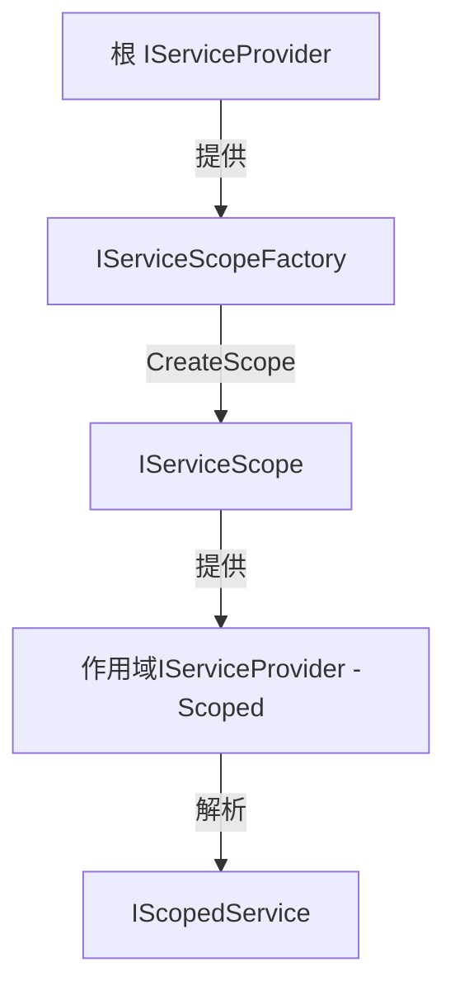
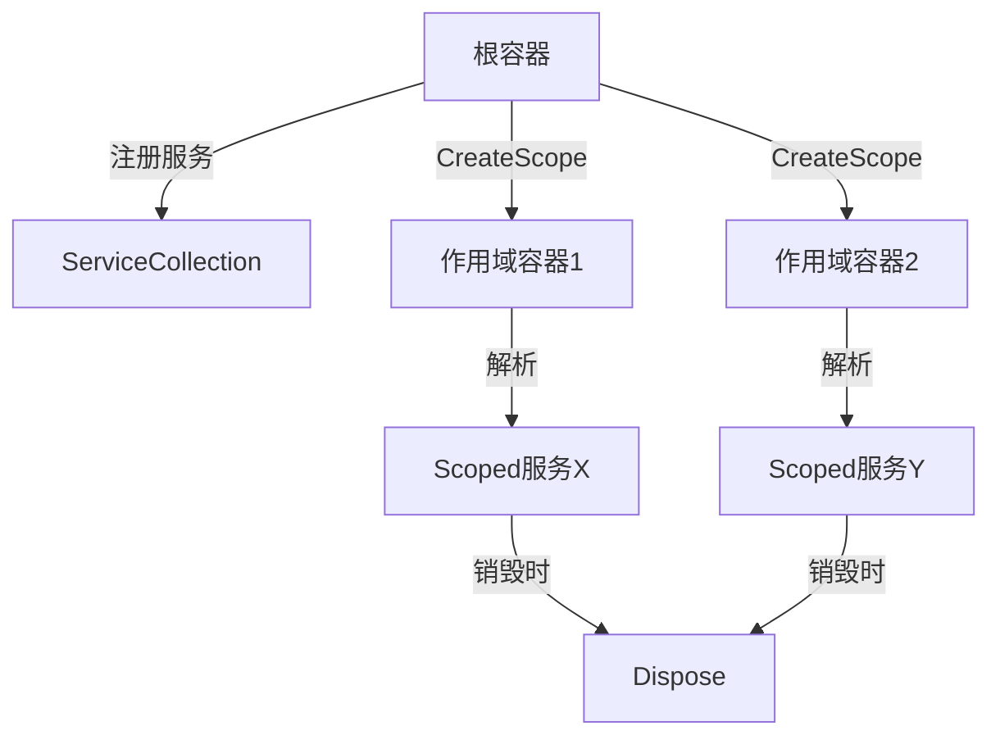

# Scope和Provider基本概念

1. **根容器**（`IServiceProvider`）提供 `IServiceScopeFactory`。
    
2. **`IServiceScopeFactory`** 创建作用域（`IServiceScope`），作用域内包含独立的 `IServiceProvider`。
    
3. **作用域内的 `IServiceProvider`** 解析 `IScopedService`，确保生命周期受作用域控制。
接口源码
https://github.com/dotnet/dotnet/tree/main/src/runtime/src/libraries/Microsoft.Extensions.DependencyInjection.Abstractions
## **`IServiceProvider`（服务容器）**
**作用**：容器，用于解析（获取）已注册的服务实例。   
**`IServiceProvider`**是服务解析的入口，使用时需注意作用域边界。
容器有2种，作用域不同。
### 根容器（Root IServiceProvider）
只有1个！作用域是整个程序。整个程序启动时生成，关闭时销毁。

- **生命周期**：    
    - **单例**：整个应用程序中只有一个根容器。**生命周期**：通常与应用程序根容器（`ApplicationServices`）或当前作用域关联。
    - **创建时机**：在应用程序启动时（如 `Host` 或 `WebApplication` 构建完成后）生成。        
    - **销毁时机**：应用程序关闭时（如调用 `IHost.Dispose()`）释放。
        
- **作用**：    
    - 用于解析 **Singleton** 和 **Transient** 服务。        
    - **不能直接解析 Scoped 服务**（会抛异常，除非在已存在的作用域内）。
        
- **获取方式**：
```csharp
var rootProvider = host.Services; // 通过 IHost.Services 或 WebApplication.Services 获取
```
### 作用域容器（Scoped IServiceProvider）
每次创建scope时生成，用来创建服务。随作用域共存亡。
- **使用场景**：    
    - 在无法直接通过构造函数注入时手动解析服务（如中间件、静态类）。        
    - **注意**：直接解析 Scoped 服务时需确保处于有效作用域内（否则可能引发异常）。
- **生命周期**：    
    - **多实例**：每次调用 `CreateScope()` 时生成一个独立的作用域容器。        
    - **创建时机**：显式调用 `IServiceScopeFactory.CreateScope()` 时创建。        
    - **销毁时机**：调用 `IServiceScope.Dispose()` 时释放该作用域内的所有 **Scoped** 和 **Transient** 服务。
        
- **作用**：    
    - 用于解析 **Scoped**、Transient 和 Singleton 服务。        
    - 确保 Scoped 服务在作用域内唯一（如每个 HTTP 请求一个 DbContext）。
获取方式
```csharp
using var scope = serviceProvider.CreateScope();//根容器创建作用域
var scopedProvider = scope.ServiceProvider; // 作用域内的 IServiceProvider
```
### 根容器 vs 作用域容器

| 特性         | 根容器 (`IServiceProvider`) | 作用域容器 (`IServiceScope.ServiceProvider`) |
| ---------- | ------------------------ | --------------------------------------- |
| **实例数量**   | 整个应用唯一                   | 每次 `CreateScope()` 生成一个                 |
| **生命周期**   | 应用启动到关闭                  | 随作用域 (`IServiceScope`) 的销毁而释放           |
| **可解析的服务** | Singleton, Transient     | Singleton, Scoped, Transient            |
| **典型用途**   | 解析基础设施服务（如日志、配置）         | 解析请求级服务（如 DbContext）                    |


源码 [IServiceProvider.cs](https://github.com/dotnet/runtime/blob/main/src/libraries/System.ComponentModel/src/System/IServiceProvider.cs)
```csharp 
namespace System
{
	public partial interface IServiceProvider
    {
        object? GetService(System.Type serviceType);
    }
}    
```
ServiceProvider源码 [ServiceProvider.cs](https://github.com/dotnet/runtime/blob/main/src/libraries/Microsoft.Extensions.DependencyInjection/src/ServiceProvider.cs)
```csharp
namespace Microsoft.Extensions.DependencyInjection
{
    /// <summary>
    /// The default IServiceProvider.
    /// </summary>
    [DebuggerDisplay("{DebuggerToString(),nq}")]
    [DebuggerTypeProxy(typeof(ServiceProviderDebugView))]
    public sealed class ServiceProvider : IServiceProvider, IKeyedServiceProvider, IDisposable, IAsyncDisposable
    {
	    ...
	    // 解析服务（可能返回 null）
	    public object? GetService(Type serviceType) 
	    // 解析服务（失败时抛异常）
	    public object GetRequiredKeyedService(Type serviceType, object? serviceKey)
	    public object? GetKeyedService(Type serviceType, object? serviceKey)
    }
```
## IServiceScopeFactory **（作用域工厂）**
- `IServiceScopeFactory` 由根容器（`IServiceProvider`）提供，用于生成子作用域。
- **作用**：创建独立的 `IServiceScope`（作用域），用于控制服务生命周期。这是创建作用域的核心工具，能用来解决 Singleton 依赖 Scoped 的问题。
源码 [IServiceScopeFactory](https://github.com/dotnet/dotnet/blob/main/src/runtime/src/libraries/Microsoft.Extensions.DependencyInjection.Abstractions/src/IServiceScopeFactory.cs)
```csharp
namespace Microsoft.Extensions.DependencyInjection
{
    /// <summary>
    /// Creates instances of <see cref="IServiceScope"/>, which is used to create
    /// services within a scope.
    /// </summary>
    public interface IServiceScopeFactory
    {
        IServiceScope CreateScope(); //创建一个新作用域
    }
}
```
## IServiceScope
源码 [IServiceScope.cs](https://github.com/dotnet/dotnet/blob/main/src/runtime/src/libraries/Microsoft.Extensions.DependencyInjection.Abstractions/src/IServiceScope.cs)
```csharp
namespace Microsoft.Extensions.DependencyInjection
{
    public interface IServiceScope : IDisposable
    {
        IServiceProvider ServiceProvider { get; }
    }    
}
```
## IServiceProviderFactory
源码 [IServiceProviderFactory](https://github.com/dotnet/dotnet/blob/main/src/runtime/src/libraries/Microsoft.Extensions.DependencyInjection.Abstractions/src/IServiceProviderFactory.cs)

```csharp
namespace Microsoft.Extensions.DependencyInjection
{
    public interface IServiceProviderFactory<TContainerBuilder> where TContainerBuilder : notnull
    {
        TContainerBuilder CreateBuilder(IServiceCollection services);
        IServiceProvider CreateServiceProvider(TContainerBuilder containerBuilder);
    }
}
```
## **`IScopedService（普通Scoped服务）`**
表示每个注册成scope的服务，自己写的。
- **作用**：表示一个**作用域内单例**的服务（每个作用域内只有一个实例）。    
- **生命周期**：    
    - 在同一个作用域内多次解析返回同一实例。        
    - 作用域结束时（`Dispose`）自动释放资源（如 `DbContext`）。
```csharp
public class ScopedService : IScopedService, IDisposable
{
    public ScopedService() => Console.WriteLine("ScopedService created");
    public void Dispose() => Console.WriteLine("ScopedService disposed");
}
```
注册
```csharp
builder.Services.AddScoped<IScopedService, ScopedService>();
```
**DI 核心原则**：类的依赖应该通过构造函数参数**显式声明**。
## 比较
| 接口/概念                  | 职责            | 生命周期           | 典型使用场景                   |
| ---------------------- | ------------- | -------------- | ------------------------ |
| `IServiceProvider`     | 解析服务实例        | 随容器或作用域共存亡     | 手动解析服务（需注意作用域边界）         |
| `IServiceScopeFactory` | 创建独立作用域       | 通常为 Singleton  | 在 Singleton 中安全使用 Scoped |
| `IScopedService`       | 实现作用域内单例的业务逻辑 | Scoped（作用域内唯一） | DbContext、有状态的辅助服务       |
# 普通Service类如何使用DI
优先直接注入 Scoped 服务

**可以注入 Scope**，但优先通过 `IServiceScopeFactory` 或直接注入 Scoped 服务实现。
> 在 .NET 的依赖注入（DI）中，**可以直接将 `IServiceScope` 或 `IServiceProvider` 注入到 Service 类**，但需谨慎处理作用域生命周期，避免内存泄漏或作用域混乱。

**避免在 Singleton 中直接持有 Scoped 服务**，必须通过作用域工厂隔离生命周期。见FAQ

## 显式注入实例，推荐
符合DI
适用场景：明确需要某个 Scoped 服务（如 DbContext）。
```csharp
public class MyService
{
    private readonly AnotherService _anotherService;
    
    // 直接注入 Scoped 服务
    public MyService(AnotherService anotherService)
    {
        _anotherService = anotherService;
    }
    
    public void DoWork()
    {
        _anotherService.Process(); // 自动复用当前请求的作用域
    }
}
```
注册方式：
```csharp
builder.Services.AddScoped<IScopedService, ScopedService>();
builder.Services.AddScoped<MyService>();
```
- **优点**：    
    - 无需手动管理作用域，由 DI 容器自动处理。        
    - 代码简洁，符合依赖注入最佳实践。
        
- **缺点**：要求 `MyService` 本身是 Scoped 或 Transient 生命周期。不能是 Singleton，不然其他service的生命周期被延长了 (Captive Dependency），这种情况是需要用下面方法手动释放作用域，推荐IServiceScopeFactory。

##  `IServiceProvider`（服务容器）
**适用场景**：需要动态解析其他服务，或延迟创建依赖。
这里注入的可能是根容器，也可能是scope容器。取决于是这个实例怎么创建的。
> 如果实例是DI解析的，注入的是根容器。
> 如果实例是scope作用域，解析的时候注入scope作用域容器。
因为解析的时候，需要判断和控制好作用域，所以显得麻烦。不然可能把transient的生命期潜在的弄长。记得用完关闭。
作用域控制方面，IServiceScopeFactory做的比较好，能按需创建作用域。
```c#
public class MyService : IDisposable
{
    private readonly IServiceScope _scope;
    private readonly AnotherService _anotherService;
    
    // 注入 IServiceProvider
    public MyService(IServiceProvider serviceProvider)
    {
        _scope = serviceProvider.CreateScope();
        _anotherService = _scope.ServiceProvider.GetRequiredService<AnotherService>();
    }
    
    public void AnotherDoWork()
    {        
            _anotherService.Process();
    }
    public void TheThirdDoWork()
    {        
            var theThirdService = _scope.ServiceProvider.GetRequiredService<TheThirdService>();
            theThirdService.Process();
    }  
    public void Dispose()
    {
        _scope?.Dispose(); // 确保释放作用域
    }
}
```
注册服务
```csharp
// 注册方式（MyService 为 Transient 或 Scoped）
builder.Services.AddScoped<MyService>(); 
builder.Services.AddScoped<AnotherService>();
builder.Services.AddScoped<TheThirdService>();
```

优点：完全控制作用域生命周期。

缺点：需手动管理 CreateScope 和 Dispose，易出错。
## **注入 `IServiceScopeFactory`**，动态解析其他服务时推荐
**适用场景**：需在类内部多次创建独立作用域。

注入IScopedService最安全
```csharp
public class MyService
{
    private readonly IServiceScopeFactory _scopeFactory;
    
    // 注入 IServiceProvider
    public MyService(IServiceScopeFactory scopeFactory)
    {
        _rootScope = serviceProvider.CreateScope();
    }
    
    public void AnotherDoWork()
    {        
        using (var scope = _scopeFactory.CreateScope())
        {
            var anotherService = scope.ServiceProvider.GetRequiredService<AnotherService>();
            anotherService.Process();
        } // 自动释放作用域
    }
    public void TheThirdDoWork()
    {        
        using (var scope = _scopeFactory.CreateScope())
        {
            var theThirdService = scope.ServiceProvider.GetRequiredService<TheThirdService>();
            theThirdService.Process();
        }
    }  
}
```
注册服务
```csharp
// 注册方式（MyService 可为 Singleton都可以）
builder.Services.AddScoped<MyService>();
//builder.Services.AddSingleton<MyService>();
builder.Services.AddScoped<AnotherService>();
builder.Services.AddScoped<TheThirdService>();
```

优点：显式管理作用域，避免生命周期冲突。比直接注入 `IServiceProvider` 更安全（减少误用风险）。

缺点：仍需手动创建和释放作用域。

# FAQ
## **为什么不能直接在 Singleton 中注入 `IScopedService`？**

- **问题**：Singleton 生命周期长于 Scoped，导致 Scoped 服务被 Singleton 持有而无法释放（称为 _Captive Dependency_）。
    
- **解决方案**：通过 `IServiceScopeFactory` 在每次需要时创建新作用域。    

## `IServiceProvider` 和 `IServiceScopeFactory` 该用哪个？**

- 若需**动态解析服务且明确当前处于有效作用域内** → 用 `IServiceProvider`。
    
- 若需**显式控制作用域生命周期**（如后台任务） → 用 `IServiceScopeFactory`。
## `IServiceScope` 需要手动释放吗？**

- **必须释放**！通过 `using` 或调用 `Dispose()`，否则 Scoped 服务不会被释放（可能引发内存泄漏）。
## 如何在Singleton服务中安全使用scoped服务
```csharp
public class SingletonService
{
    private readonly IServiceScopeFactory _scopeFactory;
    
    public SingletonService(IServiceScopeFactory scopeFactory)
    {
        _scopeFactory = scopeFactory;
    }
    
    public void Process()
    {
        using (var scope = _scopeFactory.CreateScope())
        {
            var scopedService = scope.ServiceProvider.GetRequiredService<IScopedService>();
            scopedService.Process(); // 安全使用 Scoped 服务
        }
    }
}
```
注册：
```csharp
builder.Services.AddSingleton<SingletonService>();
builder.Services.AddScoped<IScopedService, ScopedService>();
```
## 根容器能解析Scoped服务吗？
不能！
根容器只能解析singleton服务和transient服务。
从根容器解析 Scoped 服务（如 `rootProvider.GetService<DbContext>()`）会抛异常：
> Cannot resolve scoped service 'X' from root provider.
**正确做法**：始终通过作用域容器解析 Scoped 服务。
```csharp
// 1. 获取根容器
var rootProvider = host.Services;

// 2. 尝试直接解析 Scoped 服务（会抛异常）
try
{
    var dbContext = rootProvider.GetRequiredService<DbContext>();
}
catch (Exception ex)
{
    Console.WriteLine(ex.Message); // 输出错误信息
}

// 3. 正确用法：创建作用域
using (var scope = rootProvider.CreateScope())
{
    var scopedProvider = scope.ServiceProvider;
    var dbContext = scopedProvider.GetRequiredService<DbContext>(); // 成功
}
```
## scope.GetRequiredService() vs scope.ServiceProvider.GetRequiredService()
在 .NET 依赖注入（DI）中，`_scope.GetRequiredService()` 和 `_scope.ServiceProvider.GetRequiredService()` **本质上是等价的**
`IServiceScope` 接口本身实现了 `IServiceProvider`，因此可以直接调用扩展方法 `GetRequiredService`。

|特性|`_scope.GetRequiredService()`|`_scope.ServiceProvider.GetRequiredService()`|
|---|---|---|
|**可读性**|更简洁|更明确（显式表明通过 ServiceProvider 解析）|
|**性能**|完全一致（编译后代码相同）|完全一致|
|**适用场景**|推荐在大多数情况下使用|需强调作用域来源时使用|
# References
[